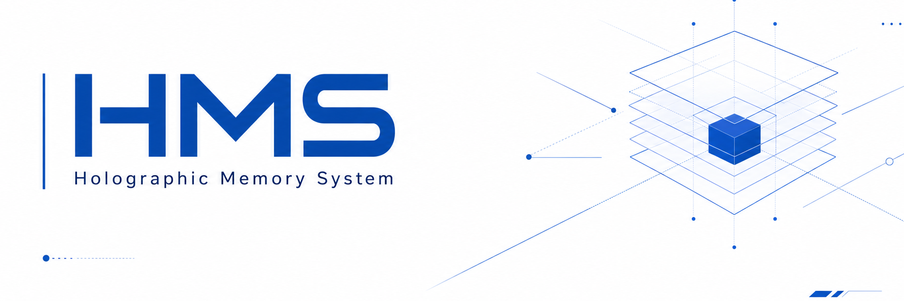
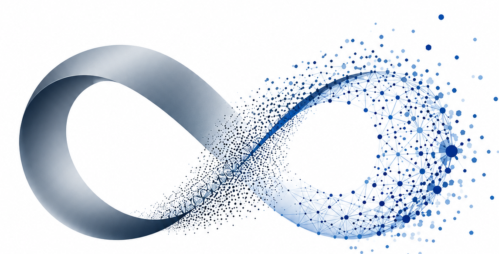
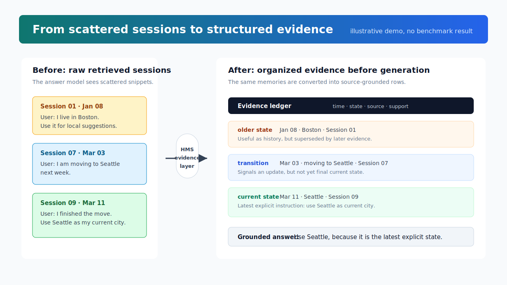

<div align="center">



### 面向长期推理的结构化记忆系统

<table>
  <tr>
    <td valign="middle"><strong>ShadowWeave Team</strong></td>
    <td width="74" align="center" valign="middle">
      
    </td>
  </tr>
</table>

<a href="https://arxiv.org/"></a>


[English](README.md) · [中文](README.zh-CN.md)

</div>

---

## 项目简介

**Holographic Memory System（HMS）** 是面向 AI 应用的结构化长期记忆层。
它能够保留会话和文档、抽取可持久化事实、连接相关实体与事件，并在后续模型
调用时召回相关上下文。

HMS 适用于需要跨 Session 记忆、但不希望每次都把完整历史塞入 Prompt 的应用。

## 一键自动记忆

HMS 可以包装现有 OpenAI client，让每次模型调用自动执行：

```text
用户输入 -> Recall 相关记忆 -> 注入上下文 -> 调用 LLM
         -> Retain 完整的用户/助手对话
```

在 `.env` 中配置模型 Base URL、API Key 和 Model 后运行：

```bash
bash scripts/run_memory_demo.sh
```

脚本会启动 PostgreSQL 和 HMS，等待 memory API 可用，在隔离环境中安装本地
SDK adapter，并运行两轮示例。第一轮保存用户偏好和当前项目，第二轮无需手动
调用 `retain()` 或 `recall()` 即可召回这些信息。

应用侧只需要一次包装：

```python
from openai import OpenAI
from hms_litellm import wrap_openai

client = wrap_openai(
    OpenAI(),
    hms_api_url="http://127.0.0.1:18080",
    api_key="YOUR_HMS_API_KEY",
    bank_id="user-alice",
)

response = client.responses.create(
    model="gpt-4o-mini",
    input="你记得我当前在做什么项目吗？",
)
```

`wrap_openai()` 支持 `client.responses.create(...)` 和
`client.chat.completions.create(...)`，也支持 streaming。每个用户应使用稳定且
独立的 `bank_id`；可以额外设置 `session_id`，把一段会话累计为 HMS 文档。

## 记忆流程

```text
Retain
  -> 解析来源内容
  -> 抽取结构化记忆
  -> 解析实体与关系
  -> 存储事实、原始片段和来源信息

Recall
  -> 分析查询
  -> 执行语义、词法、图和时间检索
  -> 融合并重排证据
  -> 返回可追溯的记忆上下文
```

HMS 会为抽取后的记忆保留来源和时间元数据，方便应用检查召回内容来自哪里、
何时被观察到。

## 可视化 Demo

仓库包含一个无需数据库即可打开的静态页面，展示 retrieved sessions 如何在
生成前被组织为可追溯证据。



可以直接在浏览器中打开：

```text
docs/memory_pipeline_demo.html
```

## 目录结构

```text
.
├── core/
│   ├── dataplane/
│   ├── daemon/
│   └── local-suite/
├── deploy/
├── docs/
│   ├── assets/
│   └── memory_pipeline_demo.html
├── examples/
├── interface/
├── scripts/
├── vendor_gateway/
├── vendor_sdk/
├── .env.example
├── README.md
└── README.zh-CN.md
```

## 环境配置

创建本地环境文件：

```bash
cp .env.example .env
```

配置 PostgreSQL、核心模型、Retain 模型和 Embedding Provider。不要提交填写后的
`.env` 文件。

启动本地服务：

```bash
bash scripts/start.sh
```

运行 Smoke Test：

```bash
bash scripts/smoke_test.sh
```

## 核心配置

| 角色 | Provider | Model | Base URL | API Key |
| --- | --- | --- | --- | --- |
| 核心记忆推理 | `HMS_API_LLM_PROVIDER` | `HMS_API_LLM_MODEL` | `HMS_API_LLM_BASE_URL` | `HMS_API_LLM_API_KEY` |
| Retain 抽取 | `HMS_API_RETAIN_LLM_PROVIDER` | `HMS_API_RETAIN_LLM_MODEL` | `HMS_API_RETAIN_LLM_BASE_URL` | `HMS_API_RETAIN_LLM_API_KEY` |
| Embedding | `HMS_API_EMBEDDINGS_PROVIDER` | `HMS_API_EMBEDDINGS_OPENAI_MODEL` | `HMS_API_EMBEDDINGS_OPENAI_BASE_URL` | `HMS_API_EMBEDDINGS_OPENAI_API_KEY` |

核心模型与 Retain 模型可以使用同一个 OpenAI-compatible endpoint，Embedding
也可以单独使用其他 Provider 或本地模型。

## 安全说明

- 不要把 `.env`、私钥、Token 和真实凭证提交到 Git。
- 内部 API 与对外 API 使用不同密钥。
- 按用户或组织隔离 Tenant 与 Bank。
- 对外部署前检查 Gateway 的配额与限流配置。

## License

参见 [LICENSE](LICENSE)。
