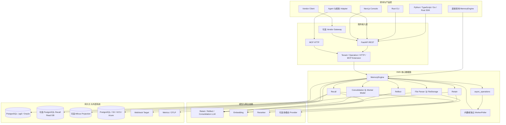
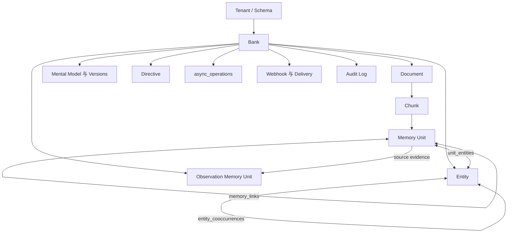
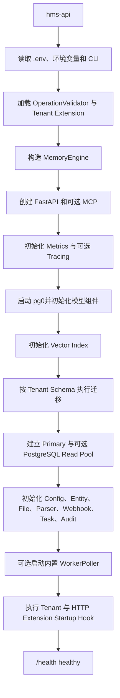
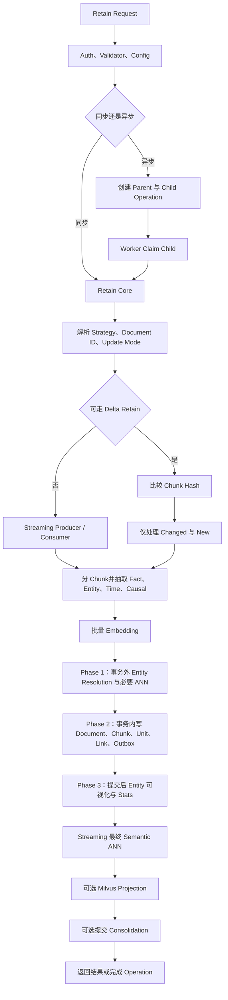
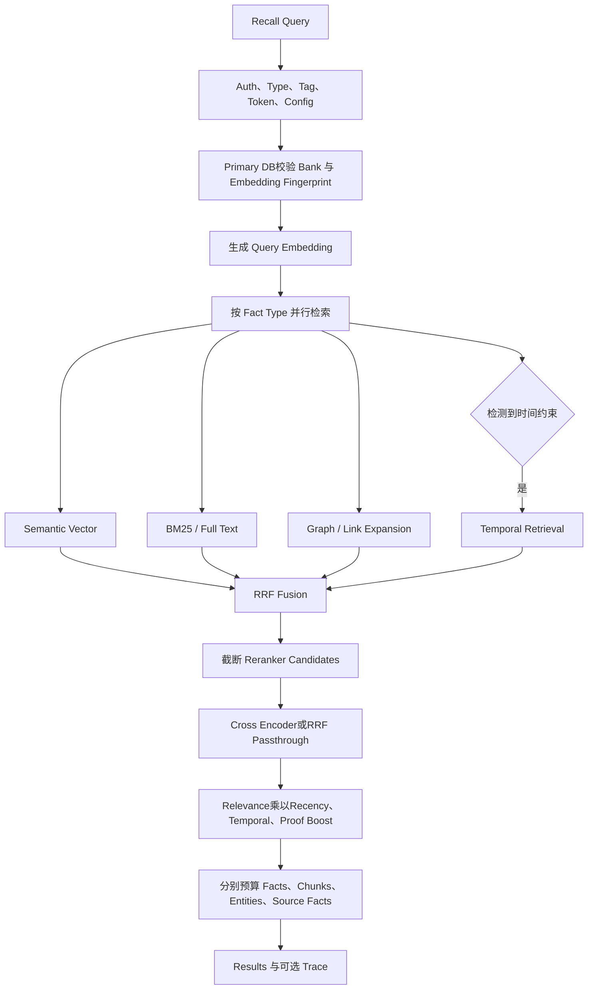
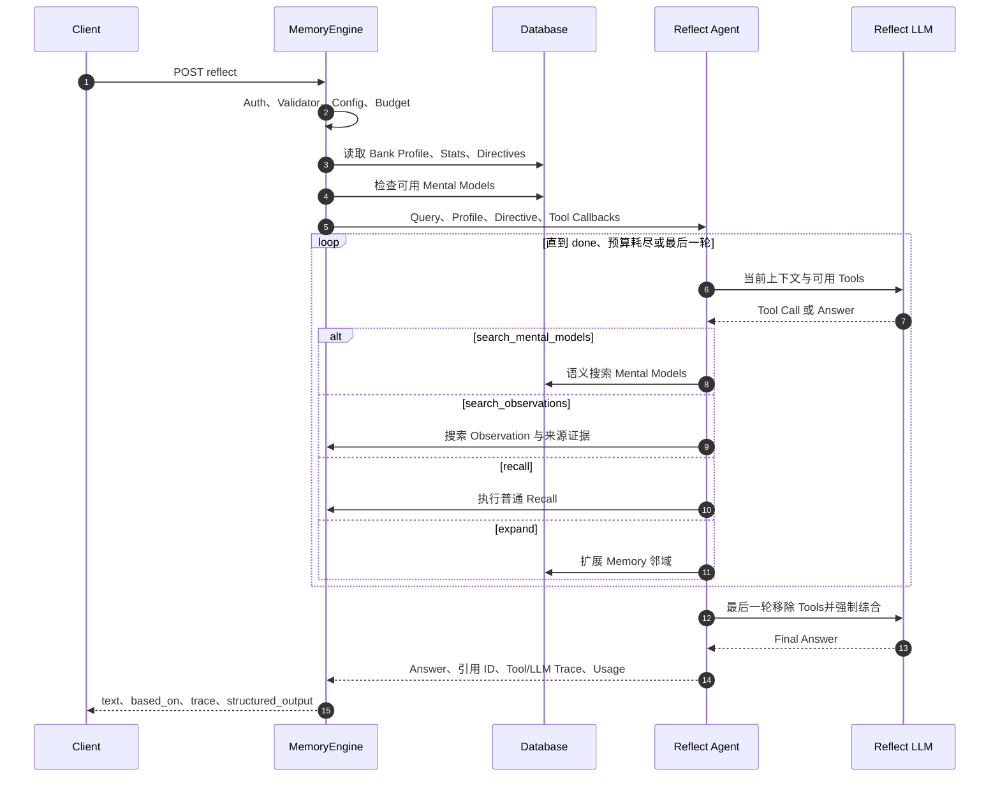
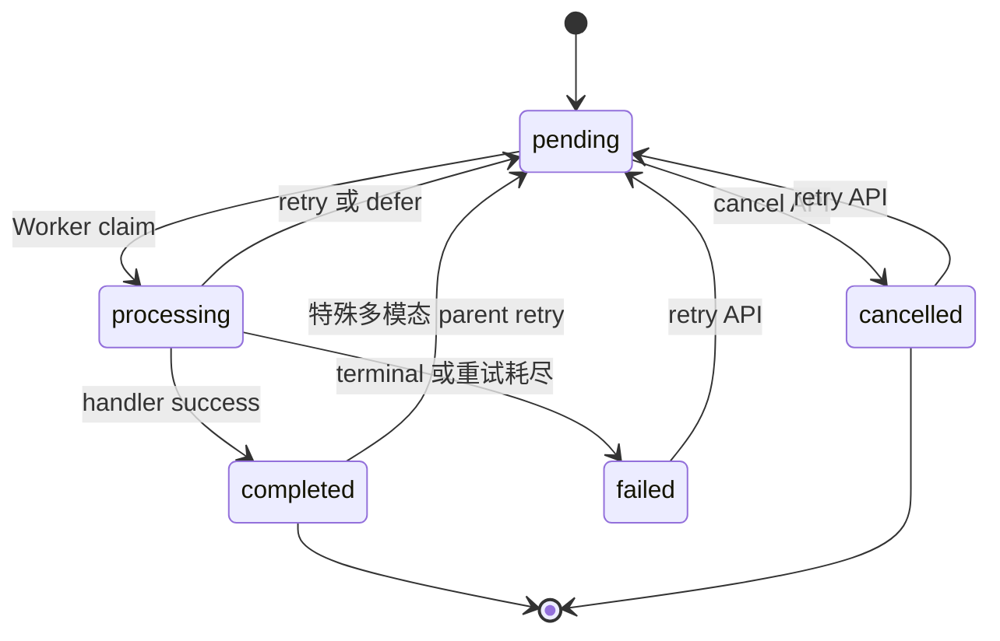

# HMS 端到端流程梳理

本文从当前仓库源码出发，梳理 HMS 从进程启动、请求接入、记忆写入、检索、反思、知识整合，到异步任务、文件、多模态、部署和运维的完整链路。

> 核对基线：提交 `72ba4207ae7f3e8f0dd9a14914984e783f428989`，源码提交日期 2026-07-23，文档核对日期 2026-07-28。本文描述当前实现，不代表未来设计。若 README、OpenAPI 描述或旧 docstring 与执行代码冲突，以执行代码为准。

## 1. 一句话理解 HMS

HMS 是一个以 `MemoryEngine` 为编排中心、以 PostgreSQL 或 Oracle 为事实源的长期记忆系统：

```text
输入文本或文件
  -> Retain：形成 document / chunk / memory unit / entity / link
  -> Recall：语义、关键词、图、时间多路检索并融合重排
  -> Reflect：LLM 通过工具循环读取事实、observation、mental model 和 directive 后作答
  -> Consolidation：把原始事实持续整合为 observation，并按需刷新 mental model
```

理解整个系统时，先记住四个边界：

1. PostgreSQL/Oracle 是 canonical store；`pg0` 只是嵌入式 PostgreSQL 的启动方式。
2. HMS 没有独立图数据库；实体和图关系都保存在关系库中。
3. Milvus 是可选、可重建的 dense vector projection，不是事实数据库，也不是必选组件。
4. Console、SDK、Adapter、Vendor Gateway 和评测工具都是接入或外围组件，不是核心数据面必经链路。

## 2. 系统总架构



### 2.1 核心与外围边界

| 区域 | 定位 | 是否属于在线核心链路 |
| --- | --- | --- |
| `core/dataplane` | API、MCP、MemoryEngine、四条业务主链、Worker、DB、迁移 | 是 |
| `core/daemon` | `hms-embed` 的本地 daemon/profile 生命周期 | 否，本地封装 |
| `core/local-suite*` | server 与 client 的 all-in-one Python 封装 | 否，本地封装 |
| `interface/sdk` | Python、TypeScript、Go、Rust 客户端 | 接入层 |
| `interface/cli` | 面向 REST API 的 Rust CLI | 接入层 |
| `interface/console` | Next.js BFF/UI 控制面 | 可选控制面 |
| `interface/adapters` | Agent、LLM 和工作流框架集成 | 可选接入层 |
| `vendor_sdk` | Vendor SDK 与窄接口 Gateway | 可选外部接入层 |
| `deploy` | Container、Compose、Helm、Dashboard | 部署层 |
| `lab/evaluation` | 评测与验证工具 | 不属于生产数据面 |
| `knowledge/site` | 文档站与 canonical OpenAPI | 合同与文档层 |

## 3. 入口、接口与公共合同

### 3.1 进程入口

`core/dataplane/pyproject.toml` 定义了四个命令：

| 命令 | Python 入口 | 用途 |
| --- | --- | --- |
| `hms-api` | `hms_api.main:main` | REST、可选 MCP、可选内置 Worker |
| `hms-worker` | `hms_api.worker.main:main` | 独立异步任务 Worker |
| `hms-local-mcp` | `hms_api.mcp_local:main` | 带 MCP 的完整本地 HTTP API，不是 stdio server |
| `hms-admin` | `hms_api.admin.cli:main` | 迁移、备份恢复、Worker 管理、重建向量投影 |

业务代码也可直接构造 `MemoryEngine`，绕过 HTTP 序列化层。

### 3.2 REST 主入口

canonical OpenAPI 是 `knowledge/site/static/openapi.json`。当前快照有 50 个 path、67 个 HTTP operation，分为 Monitoring、Banks、Memory、Files、Operations、Documents、Entities、Mental Models、Directives、Webhooks、Audit 和 Bank Templates。

最重要的入口如下：

| 方法 | 路径 | 作用 |
| --- | --- | --- |
| `GET` | `/health` | API 与数据库健康检查 |
| `GET` | `/version` | 版本和 feature flags |
| `GET` | `/metrics` | Prometheus 格式指标 |
| `PUT` | `/v1/default/banks/{bank_id}` | 创建或更新 Bank |
| `POST` | `/v1/default/banks/{bank_id}/memories` | Retain 文本记忆 |
| `POST` | `/v1/default/banks/{bank_id}/memories/recall` | Recall 原始证据 |
| `POST` | `/v1/default/banks/{bank_id}/reflect` | 基于记忆生成答案 |
| `POST` | `/v1/default/banks/{bank_id}/files/retain` | 异步文件转记忆 |
| `GET` | `/v1/default/banks/{bank_id}/operations/{operation_id}` | 查询异步状态 |
| `POST` | `/v1/default/banks/{bank_id}/consolidate` | 手动提交 Consolidation |

其余接口围绕 Bank 配置、记忆和文档 CRUD、Chunk、Entity、Mental Model、Directive、Webhook、Audit 和 Operation 管理展开。

### 3.3 MCP

MCP 与 REST 共用同一个 `MemoryEngine` 和 lifespan：

- `/mcp`：multi-bank 模式，工具可带 `bank_id`。
- `/mcp/{bank_id}`：single-bank 模式，Bank 来自 URL，适合 Agent 隔离。
- multi-bank 的 Bank 解析优先级为 URL、`X-Bank-Id`、`HMS_MCP_BANK_ID`。
- `HMS_API_MCP_ENABLED_TOOLS` 可做全局工具 allowlist。
- MCP transport 可先校验 `HMS_API_MCP_AUTH_TOKEN`，否则委托 `TenantExtension.authenticate_mcp()`。

## 4. 核心对象、数据模型与事实源

### 4.1 数据层次

```text
tenant / database schema
  -> bank
       -> document
            -> chunk
                 -> memory_unit
```



### 4.2 主要持久化对象

| 对象/表 | 作用 |
| --- | --- |
| `banks` | Bank profile、mission、disposition 和 Bank 级配置 |
| `documents` | 逻辑来源、原文、content hash、metadata、当前发布状态 |
| `chunks` | 文档分块、chunk hash、原文证据和 delta retain 粒度 |
| `memory_units` | 可检索事实、embedding、时间、类型、tags、来源和 projection metadata |
| `entities` | Bank 内 canonical entity |
| `unit_entities` | Memory Unit 与 Entity 的多对多关系，也是图检索关键输入 |
| `entity_cooccurrences` | Entity 共现统计 |
| `memory_links` | temporal、semantic、entity、causal 等 Unit 间关系 |
| `mental_models` / versions | 可版本化、可异步刷新的 living document |
| `directives` | Reflect 必须遵守的规则 |
| `async_operations` | 对外 Operation 状态表，同时也是内部持久化任务 broker |
| `webhooks` | Bank 级 webhook 配置；delivery 也使用 Operation 跟踪 |
| `audit_log` | 可选数据库审计记录 |
| `file_storage` | 默认 PostgreSQL 二进制文件存储 |
| 多模态 ledger 表 | descriptor cache、segment checkpoint、document head、document command |

当前公开 Recall 类型是 `world`、`experience`、`observation`。`opinion` 已从主链移除，仅保留部分向后兼容处理。

### 4.3 数据库、向量和图的关系

- PostgreSQL 或 Oracle 保存 canonical document、fact、tag、time、entity 和 graph 数据。
- 默认 dense semantic index 也在数据库内；PostgreSQL 通常使用 pgvector 或可选扩展。
- 配置 Milvus 后，SQL 提交完成再同步外部 projection。Milvus 命中后仍需回 SQL hydrate 和过滤。
- Milvus 同步失败不会回滚 SQL；对应 scope 会标记 degraded，Recall 回退数据库 semantic search。
- 图不是外置图数据库：`entities`、`unit_entities`、`entity_cooccurrences` 和 `memory_links` 就是图数据。

## 5. 启动与关闭流程

### 5.1 API 启动



详细顺序是：

1. `hms-api` 先读取配置和 CLI override，再加载 operation validator、tenant extension。
2. 创建 `MemoryEngine`，并把 extension context 注入 tenant extension。
3. `create_app()` 创建 FastAPI；MCP 开启时同时创建 multi-bank 和 single-bank server，并串联 lifespan。
4. FastAPI lifespan 先初始化 Prometheus/OpenTelemetry metrics；开启 OTLP tracing 时再初始化 tracer。
5. `MemoryEngine.initialize()` 在可并行处同时启动 pg0、embedding、query analyzer、reranker，并检查各 LLM role。LLM 连通性检查失败只记录 warning，API 仍会启动；provider 恢复前，依赖 LLM 的操作仍可能失败。
6. 初始化 database backend 和可选 vector index，按租户 schema 运行 Alembic migration，并校验数据库索引/embedding 维度。
7. 建立 primary pool；PostgreSQL backend 配置 read database 时再建立 Recall read pool。Oracle backend 当前忽略该配置。
8. 初始化 entity resolver、`ConfigResolver`、FileStorage、ParserRegistry、多模态 parser、WebhookManager、TaskBackend 和 AuditLogger。
9. `HMS_API_WORKER_ENABLED=true` 时，API lifespan 创建内置 `WorkerPoller`。
10. 最后执行 tenant/HTTP extension startup hook。lifespan 完成后服务才进入可用状态。

当前代码默认值适合单机体验：数据库 URL 为 `pg0`，监听 `0.0.0.0:8888`，MCP、内置 Worker、文件上传、observation 和启动迁移默认开启；多模态默认关闭。Compose、Helm 或生产环境通常会覆盖这些值。

### 5.2 关闭

关闭时先让 Worker graceful shutdown，再执行 extension shutdown hook，随后 `MemoryEngine.close()`：停止 audit retention sweep、关闭 task backend 和 webhook HTTP client、关闭 vector index/多模态 provider/read backend/primary backend、清理四个 LLM role，最后停止由本进程启动的 pg0。

## 6. 请求的统一前置链路

不同业务接口的参数不同，但核心请求大致共享以下前置步骤：

1. FastAPI/Pydantic 校验路径、JSON、multipart 和枚举字段。
2. `Authorization` 支持 `Bearer <token>` 或直接 token，转换为 `RequestContext`。
3. `TenantExtension.authenticate()` 返回当前 schema，并写入 async-safe context variable。
4. 可选 `OperationValidatorExtension` 执行操作前验证，并可收紧 tags 等部分作用域。
5. 确认或懒创建 Bank，所有后续 SQL 都带当前 schema 和 `bank_id` 边界。
6. `ConfigResolver` 为本次请求解析全量有效配置。
7. 进入 Retain、Recall、Reflect 或管理操作，并记录 metrics/tracing/audit。
8. 操作完成后调用可选 extension completion hook；hook 失败通常只告警，不回滚已完成业务。

配置解析优先级是：

```text
Global environment
  -> TenantExtension override
  -> banks.config override
```

后面的层级覆盖前面的层级。只有标记为 configurable 的行为字段能在 tenant/bank 层覆盖；API key、credential、Base URL 和数据库等基础设施字段不能通过 Bank Config API 修改。

## 7. Retain：输入如何形成长期记忆

### 7.1 HTTP 合同和同步/异步分流

入口：

```text
POST /v1/default/banks/{bank_id}/memories
```

每个 `MemoryItem` 可带：

- `content`、`timestamp`、`context`、`metadata`；
- `document_id`、显式 `entities`、`tags`；
- `observation_scopes`；
- 命名 `strategy`；
- `update_mode=replace|append`。

HTTP 先按 item 的 `strategy` 分组，不同 strategy 独立提交。`timestamp="unset"` 明确表示事实不带事件时间。

| 模式 | 行为 | HTTP 返回 |
| --- | --- | --- |
| `async=false` | 当前请求等待所有 strategy group 完成 | 成功状态、item 数和 token usage |
| `async=true` | 每个 strategy group 创建一组持久化 Operation | 首个 `operation_id`；多组时另有 `operation_ids` |

若启用了 provider Batch API，HTTP 会拒绝同步 Retain，要求使用 `async=true`。同一批输入里重复使用同一个 `document_id` 会被拒绝，而不是自动合并。

### 7.2 总流程



### 7.3 具体执行步骤

1. **认证与配置**：设置 tenant/schema，运行 operation validator，解析 Bank 配置和命名 strategy。优先级为显式 strategy 高于 Bank 的默认 strategy。
2. **确定文档身份**：即使调用方没传 `document_id`，HMS 也会生成内部 UUID，并创建 `documents` 和 `chunks`。
3. **更新模式**：默认 `replace`；`append` 会读取已有 `documents.original_text`，拼入新内容后重新计算文档状态。
4. **写前 embedding fingerprint 检查**：防止同一个 Bank 静默混入不同模型、维度或语义空间的 embedding；写事务内还会再次持锁校验。
5. **优先尝试 delta retain**：已有文档具备 chunk hash 时，比较新旧 chunk：
   - unchanged：保留已有 fact、entity 和 link；
   - changed/new：重新抽取和写入；
   - changed/removed 的旧 chunk：删除并利用外键清理对应 unit/link；
   - 完全相同：只更新文档 metadata/tags，处理 token 可为 0。
6. **并发复核**：delta 根据旧快照计算后，在 `SELECT ... FOR UPDATE` 事务中再次验证 document hash。快照已变化时，普通路径回退 full streaming；有 publication fence 的路径会失败并交给重试，避免错误发布。
7. **统一 streaming 路径**：不能走 delta 时，所有普通文本都进入 producer/consumer mini-batch 流程。大文档不是“一个大事务”，而是每个 consumer mini-batch 独立提交。
8. **分块**：会话 JSON 尽量按 turn 切分；普通文本使用递归文本切分器。Chunk 同时保存确定性 ID 和 SHA-256 hash。
9. **事实抽取**：`concise`、`verbose`、`custom`、`verbatim` 等模式通过 retain LLM 生成结构化事实、实体、时间、类型和可选 causal relation；LLM 输出的 `fact_type=assistant` 映射为公开类型 `experience`，`fact_type=world` 映射为 `world`；遇到异常类型时，仅当 `fact_kind=assistant` 才映射为 `experience`，否则归为 `world`；`retain_mission` 和 custom instruction 可调整抽取规则。
10. **可信 `chunks` 模式**：跳过自由事实抽取，每个 chunk 直接形成 `world` unit，只接受显式提供的 entity。多模态 canonical Markdown 使用这条 seam，避免视觉证据被第二次改写。
11. **Embedding**：对事实文本批量生成 embedding。Embedding 失败时事实仍可写 SQL，embedding/projection 标记失败；代价是该事实暂时缺少 dense semantic 能力，而不是整次 Retain 必然失败。
12. **Phase 1，事务外**：在独立连接上做 canonical entity resolution；非 streaming/delta 路径还可预计算 semantic ANN。placeholder Unit ID 会在插入后映射为真实 ID。
13. **Phase 2，事务内**：
    - 锁定并校验 Bank embedding fingerprint 和 document ownership；
    - 写 `documents`、`chunks`、`memory_units`；
    - 写 `unit_entities`；
    - 写 temporal、semantic、causal 等 `memory_links`；
    - 最后一批执行 publication callback 和 transactional webhook outbox。
14. **Phase 3，提交后 best effort**：刷新 entity stats，构建主要用于可视化的 entity links。关键图检索依赖 Phase 2 已写入的 `unit_entities`，所以 Phase 3 失败不回滚记忆。
15. **Streaming final ANN**：所有 mini-batch 提交后，为整次写入的 Unit 做最终 semantic link pass。它也是提交后 best effort；恢复路径可从数据库读取已提交 Unit 后补做。
16. **外部向量投影**：仅配置 Milvus 时才执行 post-commit upsert/delete。失败不回滚 SQL，并触发 Recall 的 SQL fallback。
17. **后续知识整合**：Bank 开启 observation 且不是内部多模态 trusted override 时，Retain 完成后异步提交 Consolidation。提交失败不会把已成功 Retain 改成失败。

### 7.4 写入一致性和恢复

- 同一 document 的并发更新依赖 document row lock、content hash、ownership check 和可选 publication CAS，不是简单的“后写覆盖前写”。
- streaming 已提交的 mini-batch 会把进度写入 Operation metadata；Worker 崩溃后可识别已提交事实并补做剩余阶段。
- 因为大文档跨多个事务，异常发生前可能已有 mini-batch 提交。重试通过 document replace/delta、hash 和 ownership 机制收敛，而不是假设全文件原子回滚。
- 当前写链没有通用的“相似事实语义去重/自动合并”。可确认的去重包括 document/chunk delta、canonical entity 和 link conflict handling。
- 外部向量、Phase 3、final ANN、Webhook delivery 和 Consolidation 都不能被描述成核心 SQL 事务的一部分。

## 8. Recall：从多路候选到可引用证据

入口：

```text
POST /v1/default/banks/{bank_id}/memories/recall
```

请求可控制 query、fact types、`low|mid|high` budget、fact token budget、query timestamp、tags/tag groups，以及是否附带 chunks、entities、observation source facts 和 trace。

### 8.1 检索主链



### 8.2 具体步骤

1. 校验 tenant、query token 上限、fact type、tags、`tags_match` 和嵌套 `tag_groups`。
2. 解析 Bank 配置，将 `low|mid|high` 映射为 fixed 或 adaptive thinking budget。
3. PostgreSQL backend 即使配置了 read database，也先到 primary 验证 Bank identity 和 embedding fingerprint，避免 replica lag 把新 Bank 误判为不存在或 legacy。
4. 生成 query embedding。
5. 在 connection budget 内按 fact type 并行检索：
   - semantic vector；
   - BM25/full-text；
   - graph/link expansion；
   - query analyzer 识别出时间范围时，才增加 temporal retrieval。
6. 数据库实现会把 semantic 与 BM25 合并成批量查询；graph/temporal 根据 fact type 并行执行。
7. 配置 Milvus 时，dense semantic 候选可来自 Milvus，但结果仍回 SQL hydrate，并重新应用 schema、Bank、fact type、tags 和时间过滤。外部索引 degraded 时直接回退 SQL。
8. 使用 Reciprocal Rank Fusion 合并三路或四路候选。
9. 先按 RRF 截断到 reranker candidate 上限，再交给本地/远程 cross-encoder；`rrf` provider 是 passthrough 兼容模式。
10. 当前最终分数以 cross-encoder relevance 为基线，再乘 recency、temporal proximity 和 observation proof count boost。passthrough 模式会用 RRF rank 构造有效的 relevance 基线，避免只按新旧排序。
11. 对排序结果执行 fact token budget；chunks 在 fact budget 之前独立从高分候选装配，因此即使 fact budget 很小，也可能按单独的 chunk budget返回原文证据。
12. entities、chunks 和 observation source facts 各有独立预算。observation 没有直接 chunk 时，会沿 source fact 找回来源 chunk。
13. `trace=true` 时返回各检索通道、时间约束、RRF、rerank 和阶段耗时。

### 8.3 当前实现注意点

- 旧 `recall_async` docstring 仍写有 MMR，但当前可确认的执行路径在 rerank 后直接组合打分和预算，没有 MMR；本文不把 MMR 作为现行算法。
- `opinion` 输入会为兼容旧客户端被静默忽略。
- HTTP 模型文字称省略 `types` 时默认 `world + experience`，但当前执行代码会传入全部 `VALID_RECALL_FACT_TYPES`，其中还包含 `observation`。依赖精确行为的调用方应显式发送 `types`。
- 可选 PostgreSQL read database 只承担适合的 Recall 读路径；身份、写入、fingerprint 和一致性锚点仍在 primary。Oracle backend 当前不启用该 read database 配置。

## 9. Reflect：Agentic Tool Loop，而不是一次固定 Recall

入口：

```text
POST /v1/default/banks/{bank_id}/reflect
```

Reflect 接收 query、budget、tags/tag groups、fact types、mental model 排除条件、最大输出 token 和可选 JSON Schema。



执行要点：

1. Reflect 先读取 Bank profile、freshness stats 和与同一 tag scope 匹配的 active directives。
2. 根据 Bank 内容和请求选用四类工具：`search_mental_models`、`search_observations`、`recall`、`expand`。
3. Mental model 不会全部预加载进 prompt；Agent 按需搜索，控制上下文大小。
4. enabled 的分层检索工具在前几轮按 mental model、observation、raw fact 的层次引导，之后由模型自动选择；同一轮的多个工具调用可以并行。
5. `low|mid|high` 会按倍率调整最大迭代数，同时还有 context token guard 和全局 wall-clock timeout。
6. 最后一轮不再提供工具，强制模型使用已收集证据完成回答。
7. `done` 中声明的 memory、observation、mental model ID 必须存在于真实工具结果；自由生成的 ID 会被过滤，不能成为引用。
8. 返回 `text`、`based_on`、可选 structured output、token usage、tool trace、LLM trace 和 applied directives。
9. `response_schema` 会在自然语言答案后再做一次结构化提取；失败时自然语言答案仍可保留。

因此，Reflect 的准确理解是“带预算、规则、工具和证据校验的推理循环”，而不是“Recall 一次后再调用一次 LLM”。

## 10. Consolidation、Observation 与 Mental Model

### 10.1 Consolidation

Consolidation 通常由 Retain 后自动异步提交，也可手动调用 `/consolidate`：

1. 读取尚未 `consolidated_at`、且未被永久失败标记的 `world`/`experience` memory unit。
2. 严格按相同 tag set 分组，避免不同可见性 scope 进入同一个普通 LLM batch。`observation_scopes` 可显式要求为一个事实运行多个受控 scope pass。
3. 对每条源事实 Recall 当前 scope 下相关 observation，并合并为 batch 上下文。
4. Consolidation LLM 输出 delete、update、create 等动作；执行时先 delete 以释放 scope 容量，再 update/create。
5. 新 observation 仍写入 `memory_units`，`fact_type=observation`，保存 source memory IDs、proof count、tags、时间和 embedding。
6. 每个动作都要验证目标 observation 确实来自该源事实允许访问的 Recall 集合，防止跨 tag 更新。
7. LLM batch 失败时递归二分；单条仍失败则写 `consolidation_failed_at`，可通过 recovery API 显式恢复。
8. 达到单轮上限时重新提交下一轮；最终一轮完成后，才检查并异步刷新匹配 tag、配置了 trigger 且确实 stale 的 Mental Model。
9. 更新 observation 后同步可选外部 vector projection，并通过 transactional outbox 产生完成事件。

Retain completed 只说明原始记忆已写入，不说明 Consolidation 已完成。

### 10.2 三种知识对象不要混淆

| 对象 | 本质 | 产生方式 | 用途 |
| --- | --- | --- | --- |
| 原始 `world/experience` | 从输入抽取或 trusted chunk 形成的事实 | Retain | Recall ground truth |
| `observation` | 多个源事实整合出的派生事实 | Consolidation | 稳定知识、Reflect 分层检索 |
| `mental_model` | 有版本、可配置触发刷新、可手工维护的 living document | API 创建/更新，异步 Reflect refresh | 高层结构、长期模型 |
| `directive` | 必须遵守的硬规则 | API 管理 | 约束 Reflect 行为 |

Mental Model 不是 Observation 的别名，一次 Consolidation 也不会把所有派生知识直接写成 Mental Model。

## 11. 文件与多模态

### 11.1 普通文件链路

入口始终异步：

```text
POST /v1/default/banks/{bank_id}/files/retain
```

```text
multipart upload
  -> 文件数、parser allowlist、单文件和整批大小校验
  -> FileStorage 保存原始文件
  -> 创建 file_convert_retain Operation
  -> Worker 读取文件并按 parser chain 转为 Markdown
  -> 原子创建 child Retain Operation
  -> child 进入普通 Retain 主链
  -> documents / chunks / memory_units / links / Recall
```

当前 FileStorage backend：

- `native`：工厂当前统一创建 `PostgreSQLFileStorage`；PostgreSQL 使用 `file_storage.BYTEA`，Oracle baseline 则创建 `file_storage.BLOB`，并由 Oracle backend 改写参数占位符和 `ON CONFLICT` upsert；
- S3；
- Google Cloud Storage；
- Azure Blob Storage。

`native` 的类名、注释和主要实现以 PostgreSQL 为主，但代码没有在 Oracle backend 下显式拒绝它，Oracle migration 和 SQL rewrite 也提供了静态兼容基础。在缺少 Oracle 文件链路集成测试依据时，只能表述为尚未确认 runtime qualification，不能宣称已经支持或完全不可用。生产 Oracle 部署可优先选择 S3、GCS 或 Azure，并在目标环境单独验证；当前多模态 runtime qualification 本身也只覆盖 PostgreSQL。

ParserRegistry 支持 MarkItDown、Iris、LlamaParse 和显式 opt-in 的 `openai_multimodal`。调用方可在请求级或单文件级给出有序 parser fallback chain。普通 parser 的 not-applicable/空结果/一般错误可尝试后继 parser；已经进入多模态处理后的 typed processing error 不会静默回退为不等价结果。

外层 file conversion Operation 的 `completed` 主要表示转换已完成且 child Retain 已可靠入队；要确认真正可检索，还应继续查看 child Operation。多模态合同额外提供动态的 `recall_ready` 证明。

### 11.2 多模态主链

多模态不是第二套记忆系统，仍使用相同文件入口，但必须显式允许/选择 `openai_multimodal`：

```text
图片或视频
  -> 本地 magic byte、MIME、大小和资源预算校验
  -> 图片：EXIF、颜色、尺寸、metadata 规范化
  -> 视频：本地 PyAV/FFmpeg 解码和确定性抽帧
  -> Responses API 严格 Structured Output
  -> evidence-closed 校验
  -> deterministic canonical Markdown
  -> trusted chunks Retain
  -> 普通 embedding、entity、link、Recall
```

关键保证：

- 原始视频永不发送给描述 provider，只发送本地选出的规范化帧；当前音轨只记录存在性，不转写。
- provider 产物必须引用系统提供的 evidence ID，不能引入未知 frame、越界时间或 reducer 未见过的新事实。
- canonical Markdown 带 asset、pipeline、evidence、uncertainty 和时间 provenance。
- child Retain 强制 `chunks` 模式，跳过第二次自由抽取 LLM，并禁止这条内部 override 触发 observation。
- descriptor cache/lease、segment checkpoint、document command 和 head CAS 支持崩溃恢复及 latest-admitted-wins。
- `recall_ready=true` 动态要求 child completed、command completed、child ID 一致且 head 已发布到对应 sequence。
- 功能默认关闭；当前 runtime qualification 限定 PostgreSQL。Oracle 的普通文本记忆能力不受影响，但 Oracle + 多模态会 fail fast。

多模态的媒体限制、采样算法、ledger、provider wire boundary、安全和运维合同已在以下专项文档展开：

- [当前系统架构与多模态处理](system_architecture_and_multimodal.md)
- [多模态图片与视频记忆](multimodal_memory.md)

## 12. 异步 Operation 与 Worker

### 12.1 数据库即 Broker

`async_operations` 同时承担两个职责：

1. 对外可查询的 Operation 状态和结果；
2. 内部持久化任务 payload、重试、worker ownership 和调度信息。

HMS 默认不依赖 Redis 或 RabbitMQ。

| TaskBackend | 使用位置 | 行为 |
| --- | --- | --- |
| `BrokerTaskBackend` | API 默认 | 把 task 持久化到 `async_operations`，等待 Poller |
| `WorkerTaskBackend` | 独立 Worker 内部 | submit 为 no-op；child 已在 DB，下一轮自然领取 |
| `SyncTaskBackend` | 测试/嵌入式 | 在当前调用栈立即执行 |

### 12.2 Retain 的 Parent/Child

异步 Retain 无论最后只有几个 sub-batch，都会：

1. 创建无 `task_payload` 的 parent `batch_retain` aggregator；
2. 创建一个或多个带 `type=batch_retain` payload 的 child `retain`；
3. 在同一个数据库事务中插入 parent 和所有 child；
4. 返回 parent Operation ID；
5. child 全部 terminal 后，在同一事务中聚合 parent 为 completed 或 failed，并带代表性 child error。

这样可避免“parent 已存在但 child 尚未写入”的永久孤儿状态。

### 12.3 状态与调度



普通 retry API 接受 `failed` 和 `cancelled`；还接受一种特殊状态：`file_convert_retain` parent 虽为 `completed`，但 metadata 表明 child Retain 已失败。其他 completed Operation 不能重试。

Worker 主循环：

1. 通过 `TenantExtension.list_tenants()` 动态发现 schema。
2. 先扫描有 pending work 的 schema，再 round-robin 领取，避免繁忙 tenant 长期饿死其他 tenant。
3. PostgreSQL claim 使用 `FOR UPDATE SKIP LOCKED`；Oracle 通过 database ops 抽象实现自己的安全 claim。
4. 每个 Worker 有 `max_slots`；operation type 可拥有 reserved pool，剩余是 shared pool。当前默认总 slot 为 10，Consolidation 默认预留 2。
5. claim 后恢复 task 所属 schema，把 payload 交给 `MemoryEngine.execute_task()`。
6. handler 可 completed、defer、定时 retry 或 failed；`execute_task()` 当前以 `_retry_count < 3` 判断是否重新调度，所以最多重新调度 3 次，即初次加重试共最多 4 次尝试。`file_convert_retain` 转换错误和数据库完整性约束错误等路径会直接 terminal。
7. Poller 记录 DB wait、pool、进度和长任务 stack。启动时 `recover_own_tasks()` 只自动重置与当前 `worker_id` 相同的普通 processing task；Worker ID 改变或旧实例永久移除时，需要用 `hms-admin decommission-worker` 或 `decommission-workers` 显式释放。当前没有可确认的、适用于所有普通 processing task 的 lease 超时自动回收机制；多模态 descriptor lease 是另一套专项机制。
8. graceful shutdown 停止新 claim，并等待正在执行的 task，超时后退出。

公共 cancel 只保证 pending Operation 的原子取消；已 processing 的 Operation 通常返回冲突。长任务仍会在内部 checkpoint 检查 operation 是否存活或 document ownership 是否已丢失。

### 12.4 内置与独立 Worker

- 默认 `hms-api` lifespan 内运行 `WorkerPoller`。
- `hms-worker` 使用同一 claim 协议，默认另开 8889 提供 `/health` 和 `/metrics`，且不执行 migration。
- Helm 开启 dedicated Worker 后会关闭 API 内置 Worker，避免重复资源配置；即使同时存在多个 Poller，DB claim 仍负责互斥。

## 13. 认证、租户、Bank 和 Tag 隔离

隔离从外到内是：

```text
Tenant / Schema
  -> Bank
       -> Tags、tags_match、tag_groups
```

### 13.1 Tenant Extension

| 实现 | 行为 |
| --- | --- |
| `DefaultTenantExtension` | 默认，无认证，固定到配置 schema；适合可信本地环境 |
| `ApiKeyTenantExtension` | 校验 `HMS_API_TENANT_API_KEY`，REST 支持 Bearer 或直接 token |
| Supabase Tenant Extension | 本地校验 JWKS，兼容旧 HS256 fallback；用户 UUID 映射独立 schema，首次访问可迁移 |
| 自定义 Extension | 可按 token/claim 映射 schema、配置和权限 |

根目录 Vendor Compose 显式启用 `ApiKeyTenantExtension`；不要把核心默认无认证误写成所有部署都无认证，也不要把 Vendor Compose 的 API key 行为误写成核心唯一认证方式。

### 13.2 Tag 语义

- tags 是 Bank 内的进一步可见性 scope。
- `tags_match` 支持 any、all 及 strict 变体；strict 变体排除 untagged 数据。
- `tag_groups` 支持 AND、OR、NOT 的组合过滤。
- Recall、Reflect、Directive、Observation 和 Mental Model refresh 都必须保持同一 scope 语义。

## 14. SDK、CLI、Console、Adapter 与 Vendor Gateway

### 14.1 SDK 和 CLI

- `interface/sdk/python`
- `interface/sdk/typescript`
- `interface/sdk/go`
- `interface/sdk/rust`
- `interface/cli`：Rust CLI

SDK 以 canonical OpenAPI 为来源，但生成器能力不完全相同。Rust 的 build-time `progenitor` 路径会过滤 multipart endpoint，因此不能笼统声称四种 SDK 都提供同等的文件上传 API。

### 14.2 Console

`interface/console` 是 Next.js UI/BFF，不直接访问数据库：

```text
Browser
  -> Next.js /api/* server routes
  -> HMS REST API
```

- `HMS_CP_ACCESS_KEY` 保护 UI 登录 cookie。
- `HMS_CP_DATAPLANE_API_KEY` 由 Console server 访问数据面。
- Console 展示 Bank、Memory、Document、Chunk、Entity graph、Operation、Mental Model、Directive、Webhook 和 Audit 等。

### 14.3 Adapter 和自动记忆包装器

`interface/adapters` 覆盖 LangGraph、LiteLLM、OpenAI Agents、CrewAI、AutoGen、LlamaIndex、Codex 等集成。LiteLLM/OpenAI wrapper 的典型自动记忆闭环是：

```text
用户输入
  -> Recall 或 Reflect
  -> 将记忆注入 LLM 上下文
  -> 调用业务 LLM
  -> Retain 用户与助手的本轮对话
  -> 返回业务响应
```

这是客户端 wrapper 形成的编排，不是 HMS API 在每次 LLM 调用时自动拦截所有流量。

### 14.4 Vendor Gateway

Vendor Gateway 实现在 `vendor_sdk/src/hms_vendor_sdk/gateway.py`，对外提供 `/v1/vendor/pipeline`、`/recall`、`/organize` 等窄接口，并负责：

- 外部 API key；
- rate limit 和 daily quota；
- audit JSONL；
- public Bank ID 到内部 scoped Bank ID 的映射；
- 调用内部 HMS API。

它不是核心 REST API，也不是 Console。当前 rate/quota 是进程内状态，重启会清零；audit 是本地 JSONL，生产环境需要按可靠性要求外置。

## 15. 部署形态

| 形态 | 拓扑和用途 |
| --- | --- |
| 本地 `hms-api` | 默认 pg0、API 8888、MCP、内置 Worker，适合开发 |
| `hms-embed` / daemon profile | 管理本地 profile、独立 pg0 和端口，适合桌面/工具集成 |
| `core/local-suite*` | Python 进程内后台 server 或自动 daemon client |
| Standalone Container | `api-only`、`cp-only` 或 `standalone`；全栈先等 API healthy 再启动 Console |
| 根目录 Compose | Vendor-facing：`nginx:8080 -> vendor gateway:18081 -> hms-api:18080 -> PostgreSQL` |
| Helm/Kubernetes | 默认 API、Console、bundled PostgreSQL；可选 dedicated Worker、TEI、Ingress、HPA |
| External DB / Index | external PostgreSQL、Oracle、Milvus Server/Zilliz 等 |
| DB 扩展示例 | vchord、pg_textsearch、Timescale、AlloyDB ScaNN 等 Compose 变体 |
| Object Storage | S3/GCS/Azure 文件 backend |

根目录 `docker-compose.yml` 不包含 Control Plane；只有 Nginx 是公开入口，HMS API 在宿主机只绑定 `127.0.0.1:18080`。它的目标是 Vendor 部署，不应当被描述成通用 Console 全栈。

生产拆分 dedicated Worker 时：

1. API 负责认证、校验和提交 Operation；
2. Worker 连接同一 canonical DB 领取任务；
3. API 与所有 Worker 必须使用兼容的代码、迁移、模型和多模态依赖；
4. migration 通常由独立步骤先执行，再让 API/Worker 启动。

## 16. Migration 与管理命令

- PostgreSQL 和 Oracle 共用 Alembic revision tree，并由 backend/dialect 分支执行。
- PostgreSQL migration 使用进程内锁和 schema advisory lock。
- 使用 PgBouncer transaction mode 时，应配置 `HMS_API_MIGRATION_DATABASE_URL` 指向数据库直连地址。
- 生产可设置 `HMS_API_RUN_MIGRATIONS_ON_STARTUP=false`，发布前运行：

```bash
hms-admin run-db-migration
```

常用管理命令：

```bash
hms-admin rebuild-vector-index --yes
hms-admin worker-status
hms-admin decommission-worker <worker-id> --yes
hms-admin decommission-workers --yes
hms-admin backup backup.zip
hms-admin restore backup.zip --yes
```

其中 backup、restore、worker status/decommission 的当前实现依赖 `asyncpg`，属于 PostgreSQL-only 管理能力，不能泛化为 Oracle 通用命令。

## 17. 可观测性、Audit 与 Webhook

### 17.1 健康、版本和指标

- `/health`：数据库健康状态，并暴露外部 vector index degraded 信息。
- `/version`：API 版本和功能开关；多模态能力需要 `include_multimodal=true` 显式协商。
- `/metrics`：Retain/Recall/Reflect、LLM token/延迟、HTTP、进程、DB pool、Worker 和多模态阶段指标。
- 独立 Worker 也提供 `/health` 和 `/metrics`。
- 仓库提供 3 个 Grafana dashboard JSON，但不包含完整的 Prometheus/Grafana 运行栈。

### 17.2 日志和 Tracing

- `HMS_API_LOG_FORMAT=text|json`。
- OTLP tracing 默认关闭；开启后可记录 LLM prompt/completion、tool call 和 token，因此必须做敏感数据分级、访问控制和保留策略。
- 多模态路径禁止把媒体 bytes、data URL、完整 provider request body 或未清洗 provider error 写入日志、Operation metadata 或 trace。

### 17.3 Audit

数据库 Audit 默认关闭，可按 action allowlist 和 retention 配置启用。Vendor Gateway 另有独立 JSONL audit，两者不是同一审计存储。

### 17.4 Webhook

- 代码支持 `retain.completed` 和 `consolidation.completed`，默认配置主要订阅 Consolidation 完成事件。
- Retain/Consolidation 的成功事件通过 transactional outbox 在主写事务内创建 delivery task。
- delivery 自身是 `webhook_delivery` Operation，由 Worker 发送和重试。
- 配置 secret 时，payload 使用 HMAC-SHA256 签名。
- 业务数据提交成功不依赖外部 webhook endpoint 当场可用。

## 18. 故障、幂等与一致性总表

| 场景 | 当前处理 | 对核心数据的影响 |
| --- | --- | --- |
| 同一 Document 并发更新 | row lock、hash 复核、ownership/publication CAS | 旧请求不能在新 command 后错误发布 |
| Retain LLM/streaming 中断 | task retry；已提交 mini-batch 可从 metadata/DB 恢复 | 不是整文档单事务，通过重试收敛 |
| Embedding 失败 | 允许写 `embedding=None` 并记录 projection 状态 | 事实保留，dense semantic 能力降级 |
| Entity Phase 3 失败 | warning，best effort | `unit_entities` 已在主事务，核心检索仍可用 |
| Final semantic ANN 失败 | warning，可后续补做 | 核心事实存在，semantic link 不完整 |
| Milvus 同步失败 | 标记 scope degraded，Recall 回退 SQL | 不回滚 canonical SQL |
| Consolidation 失败 | batch 二分；单条标记 failed，可恢复 | 不回滚原始 Retain |
| Webhook endpoint 失败 | delivery Operation 重试 | 不回滚业务事务 |
| Worker 崩溃 | 相同 `worker_id` 重启会恢复普通 task；ID 变化时由管理员 decommission 后重试；payload 仍在 DB | 没有通用 processing lease 超时自动回收 |
| Read replica 延迟 | Bank identity/fingerprint 仍查 primary | 避免新 Bank 被误判；普通读仍可能受复制延迟 |
| Pending Operation cancel | DB 原子改 cancelled | 不会被后续 claim |
| Processing Operation cancel | 公共接口通常拒绝；内部 checkpoint 检查 | 不能承诺任意时刻强杀无副作用 |
| 多模态 provider 已接收后 Worker 崩溃 | lease 过期后重试并标 possible duplicate | 外部调用是 at-least-once，不承诺 exactly-once billing |

## 19. 最小运行与调用示例

### 19.1 启动核心 API

按核心 README 的已发布包方式：

```bash
python -m pip install hms-api
export HMS_API_LLM_PROVIDER=openai
export HMS_API_LLM_API_KEY='replace-with-your-key'
hms-api
```

默认服务地址是 `http://localhost:8888`。默认 tenant extension 不校验 token；若部署启用了 API key extension，下面所有请求都应增加：

```text
Authorization: Bearer <HMS_API_TENANT_API_KEY>
```

### 19.2 创建 Bank

```bash
curl -sS -X PUT 'http://localhost:8888/v1/default/banks/demo' \
  -H 'Content-Type: application/json' \
  -d '{
    "reflect_mission": "记住用户偏好和项目上下文，并基于证据回答。",
    "retain_mission": "抽取稳定偏好、人物、项目和明确变更。"
  }'
```

### 19.3 同步 Retain

```bash
curl -sS -X POST 'http://localhost:8888/v1/default/banks/demo/memories' \
  -H 'Content-Type: application/json' \
  -d '{
    "items": [{
      "content": "用户小王偏好深色主题，当前正在开发 HMS 项目。",
      "document_id": "conversation-001",
      "tags": ["user:xiaowang"]
    }],
    "async": false
  }'
```

### 19.4 Recall

显式传 `types`，避免依赖当前默认值与 OpenAPI 描述之间的漂移：

```bash
curl -sS -X POST 'http://localhost:8888/v1/default/banks/demo/memories/recall' \
  -H 'Content-Type: application/json' \
  -d '{
    "query": "小王喜欢什么界面主题，正在做什么项目？",
    "types": ["world", "experience", "observation"],
    "budget": "mid",
    "max_tokens": 2048,
    "tags": ["user:xiaowang"],
    "tags_match": "all_strict",
    "include": {"chunks": {"max_tokens": 2048}},
    "trace": true
  }'
```

### 19.5 Reflect

```bash
curl -sS -X POST 'http://localhost:8888/v1/default/banks/demo/reflect' \
  -H 'Content-Type: application/json' \
  -d '{
    "query": "我应该为小王推荐什么界面设置？请说明依据。",
    "budget": "low",
    "tags": ["user:xiaowang"],
    "tags_match": "all_strict",
    "include": {"facts": {}, "tool_calls": {"output": true}}
  }'
```

### 19.6 异步 Retain 和轮询

```bash
curl -sS -X POST 'http://localhost:8888/v1/default/banks/demo/memories' \
  -H 'Content-Type: application/json' \
  -d '{
    "items": [{
      "content": "这是一段需要后台处理的长文档。",
      "document_id": "document-async-001"
    }],
    "async": true
  }'
```

拿响应中的 parent `operation_id` 轮询：

```bash
curl -sS 'http://localhost:8888/v1/default/banks/demo/operations/<operation-id>'
```

### 19.7 文件 Retain

```bash
curl -sS -X POST 'http://localhost:8888/v1/default/banks/demo/files/retain' \
  -F 'files=@./example.pdf' \
  -F 'request={"parser":"markitdown","files_metadata":[{"document_id":"example-pdf"}]}'
```

响应返回 conversion Operation ID；转换完成后继续检查其 child Retain 状态。

### 19.8 根目录 Vendor 部署

```bash
cp .env.example .env
bash scripts/generate_keys.sh
bash scripts/start.sh
bash scripts/smoke_test.sh
```

这套命令启动的是 Vendor-facing Compose，而不是 Console 全栈。

## 20. 关键源码索引

| 主题 | 文件 |
| --- | --- |
| API CLI 入口 | [`core/dataplane/hms_api/main.py`](../core/dataplane/hms_api/main.py) |
| FastAPI、模型和全部 REST 路由 | [`core/dataplane/hms_api/api/http.py`](../core/dataplane/hms_api/api/http.py) |
| REST/MCP 统一 App | [`core/dataplane/hms_api/api/__init__.py`](../core/dataplane/hms_api/api/__init__.py) |
| MCP middleware 与 server | [`core/dataplane/hms_api/api/mcp.py`](../core/dataplane/hms_api/api/mcp.py) |
| 核心编排 | [`core/dataplane/hms_api/engine/memory_engine.py`](../core/dataplane/hms_api/engine/memory_engine.py) |
| Retain orchestrator | [`core/dataplane/hms_api/engine/retain/orchestrator.py`](../core/dataplane/hms_api/engine/retain/orchestrator.py) |
| Fact extraction | [`core/dataplane/hms_api/engine/retain/fact_extraction.py`](../core/dataplane/hms_api/engine/retain/fact_extraction.py) |
| Recall 检索 | [`core/dataplane/hms_api/engine/search/retrieval.py`](../core/dataplane/hms_api/engine/search/retrieval.py) |
| RRF | [`core/dataplane/hms_api/engine/search/fusion.py`](../core/dataplane/hms_api/engine/search/fusion.py) |
| Rerank 与最终打分 | [`core/dataplane/hms_api/engine/search/reranking.py`](../core/dataplane/hms_api/engine/search/reranking.py) |
| Reflect agent | [`core/dataplane/hms_api/engine/reflect/agent.py`](../core/dataplane/hms_api/engine/reflect/agent.py) |
| Reflect tools | [`core/dataplane/hms_api/engine/reflect/tools.py`](../core/dataplane/hms_api/engine/reflect/tools.py) |
| Consolidation | [`core/dataplane/hms_api/engine/consolidation/consolidator.py`](../core/dataplane/hms_api/engine/consolidation/consolidator.py) |
| TaskBackend | [`core/dataplane/hms_api/engine/task_backend.py`](../core/dataplane/hms_api/engine/task_backend.py) |
| WorkerPoller | [`core/dataplane/hms_api/worker/poller.py`](../core/dataplane/hms_api/worker/poller.py) |
| 配置定义 | [`core/dataplane/hms_api/config.py`](../core/dataplane/hms_api/config.py) |
| 分层配置解析 | [`core/dataplane/hms_api/config_resolver.py`](../core/dataplane/hms_api/config_resolver.py) |
| Tenant 实现 | [`core/dataplane/hms_api/extensions/builtin/tenant.py`](../core/dataplane/hms_api/extensions/builtin/tenant.py) |
| Webhook Manager | [`core/dataplane/hms_api/webhooks/manager.py`](../core/dataplane/hms_api/webhooks/manager.py) |
| Migration | [`core/dataplane/hms_api/alembic`](../core/dataplane/hms_api/alembic) |
| canonical OpenAPI | [`knowledge/site/static/openapi.json`](../knowledge/site/static/openapi.json) |
| Console BFF client | [`interface/console/src/lib/hms-client.ts`](../interface/console/src/lib/hms-client.ts) |
| Vendor Gateway | [`vendor_sdk/src/hms_vendor_sdk/gateway.py`](../vendor_sdk/src/hms_vendor_sdk/gateway.py) |
| 根目录 Vendor Compose | [`docker-compose.yml`](../docker-compose.yml) |
| Helm | [`deploy/charts/hms`](../deploy/charts/hms) |

## 21. 当前已知文档漂移和限制

维护和排障时应特别注意：

1. `recall_async` 旧 docstring 的 MMR 与当前执行路径不一致。
2. Retain 路由描述中的“相似事实自动去重”不能从当前通用写链确认。
3. Retain 的旧说明可能写“ONE transaction”，当前统一 streaming 是每个 mini-batch 一次事务。
4. Recall 省略 `types` 时，当前执行代码包含 observation，但 OpenAPI 字段描述称默认只有 world/experience。
5. `opinion` 已退出主检索类型，部分 README/Adapter 示例仍使用旧术语。
6. README 所画 `vendor_gateway/` 目录已漂移；当前实现位于 `vendor_sdk/src/hms_vendor_sdk/gateway.py`。
7. 根目录 Compose 不含 Console。
8. `hms-local-mcp` 是完整 HTTP API，不是 stdio-only MCP。
9. daemon README 的 idle timeout 默认 300 已过时，当前代码默认是 0。
10. Helm README 部分镜像/版本说明可能陈旧，应以 `values.yaml` 和 template 为准。
11. Helm 配置中出现的 `HMS_API_WORKER_BATCH_SIZE` 在当前 `config.py` 没有对应项；实际并发看 `HMS_API_WORKER_MAX_SLOTS` 和 slot reservations。
12. `config.py` 使用 `load_dotenv(..., override=True)`，工作目录找到的 `.env` 会覆盖已存在的进程环境变量，生产启动时必须明确控制工作目录和配置来源。
13. 多模态当前是 opt-in engineering preview，且 runtime qualification 只覆盖 PostgreSQL。
14. `HMS_API_WORKER_MAX_RETRIES` 和 `hms-worker --max-retries` 当前会被读取并展示，但没有接入 `execute_task()` 的重试判断；实际判断仍硬编码为 `_retry_count < 3`，即最多 3 次重新调度、总计最多 4 次尝试。
15. `native` FileStorage 工厂当前统一创建以 PostgreSQL 为主的 `PostgreSQLFileStorage`；Oracle 有 BLOB migration 和 SQL rewrite 静态兼容基础，但尚不能宣称已通过 native file storage runtime qualification。
16. Vendor Gateway rate/quota 为内存状态，Gateway audit 是本地文件；它们本身不是高可用的分布式控制面。

## 22. 推荐阅读顺序

如果要继续深入代码，建议按以下顺序：

1. `api/http.py`：先看请求/响应合同和 REST 分流。
2. `engine/memory_engine.py`：理解认证、配置、编排和跨流程连接点。
3. `engine/retain/orchestrator.py`：理解文档更新、三阶段写入和恢复。
4. `engine/search/*`：理解多路检索、RRF、rerank 和预算。
5. `engine/reflect/agent.py` 与 `tools.py`：理解 Agentic Reflect。
6. `engine/consolidation/consolidator.py`：理解 Observation 和 Mental Model 后续链路。
7. `engine/task_backend.py`、`worker/poller.py`：理解数据库 broker 和异步执行。
8. `docs/system_architecture_and_multimodal.md`、`docs/multimodal_memory.md`：深入多模态协议和运维边界。
