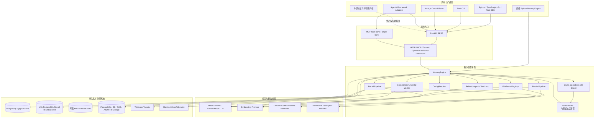
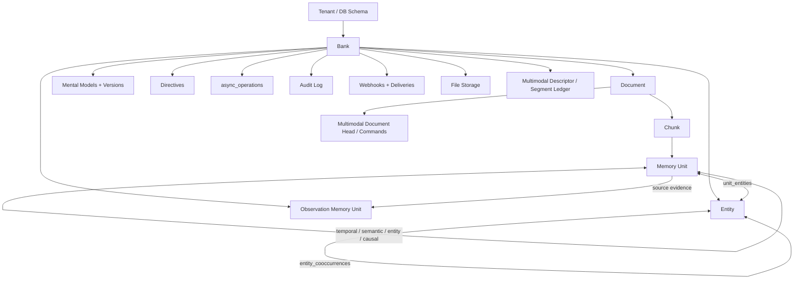
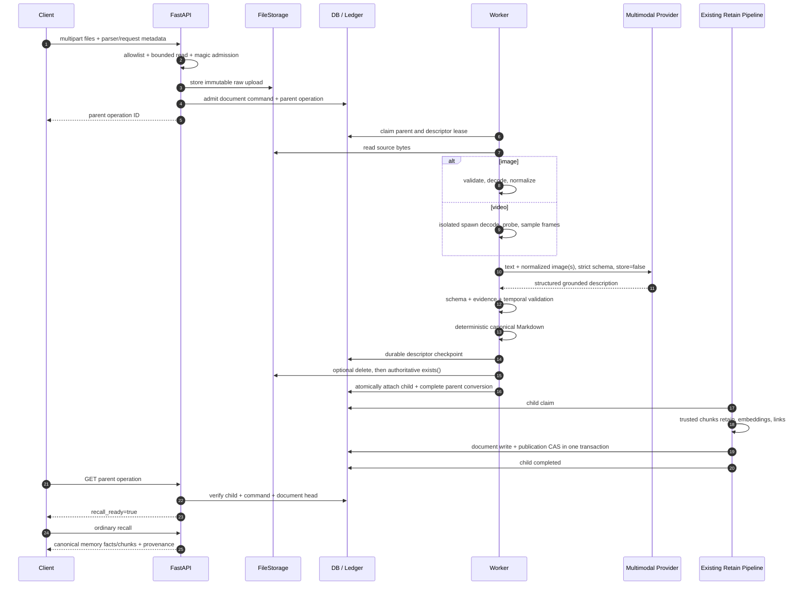
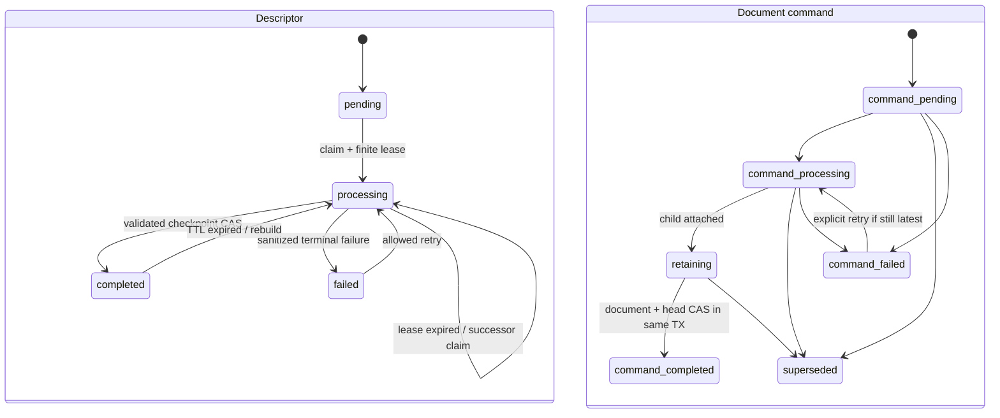

# HMS 当前系统架构与多模态记忆处理详解

本文描述当前 checkout 中实际存在的 HMS 架构，以及图片、视频如何进入既有记忆主链。它面向维护者、集成方和部署人员，不是未来设计提案。

核对日期：2026-07-23（UTC）。本文以当前源码、canonical OpenAPI 和公开的 [`multimodal_memory.md`](multimodal_memory.md) 运维合同为准。

当前公共合同已经包含 opt-in capability、typed operation metadata、canonical OpenAPI 与对应 SDK 类型。当前发布的 multimodal runtime 支持矩阵限定为 PostgreSQL；Oracle 保留静态兼容，并在启用未验证的多模态组合时 fail-fast。

## 1. 一句话理解当前系统

HMS 是一个以 `MemoryEngine` 为编排中心、以关系数据库为事实源的结构化长期记忆系统：输入在 retain 阶段变成 document、chunk、memory unit、entity 和多种 memory link；recall 同时运行语义、关键词、图和可选时间检索，再融合、重排并按预算返回证据；reflect 则让 LLM 通过工具循环使用这些证据、mental model、observation 和 directive 生成答案。

多模态不是第二套记忆系统。图片或视频先被本地校验、规范化和描述为带证据的 deterministic canonical Markdown，然后以可信 `chunks` 模式进入完全相同的 document/chunk/memory-unit/embedding/link/recall 主链。

## 2. 系统总拓扑



这里有三个容易混淆的边界：

1. 验证与评测工具会调用 HMS，但它们是外部客户端，不属于线上数据平面。
2. `WorkerPoller` 可以随 API 进程启动，也可以放在独立 `hms-worker` 进程；独立 worker 不是所有部署的硬要求。
3. PostgreSQL、Oracle 是 HMS 整体的数据库 backend；“多模态本期只验收 PostgreSQL”不等于“HMS 整体不支持 Oracle”。

## 3. 仓库分层

| 区域 | 当前职责 |
| --- | --- |
| `core/dataplane` | FastAPI/MCP、`MemoryEngine`、retain/recall/reflect、worker、数据库抽象、存储、迁移、metrics/tracing，是生产核心。 |
| `core/daemon` | `hms-embed` 本地 daemon/profile 管理，默认可配合 pg0 提供低启动成本的本地体验。 |
| `core/local-suite`、`core/local-suite-slim` | 将 server 与客户端封装为 all-in-one Python 使用方式。 |
| `interface/sdk` | Python、TypeScript、Go 的 checked-in generated client，以及构建时从 OpenAPI 生成的 Rust client。 |
| `interface/cli` | 面向 REST API 的 Rust CLI。 |
| `interface/console` | Next.js Control Plane，通过自己的 server routes 代理 HMS API，展示 bank、memory、document、entity graph、operation、audit、webhook 等。 |
| `interface/adapters` | LangGraph、LiteLLM、OpenAI Agents、Strands、AG2、AgentCore、Codex 等集成。 |
| `deploy` | standalone/container、Docker Compose、Helm 和 Grafana dashboard。 |
| `knowledge/site` | 文档站资源；`static/openapi.json` 是 canonical OpenAPI。 |
| `lab/evaluation` | 本地验证工具；公开发布不包含外部数据集、答案、评分产物或运行结果。 |
| `docs` | 用户、架构、运维、ADR 和 API 文档。 |

## 4. 接口与合同层

### 4.1 三种核心接入方式

- HTTP REST：由 `core/dataplane/hms_api/api/http.py` 创建 FastAPI 应用，覆盖 bank、memory、file、operation、document、entity、mental model、directive、webhook、audit 和 monitoring。
- MCP：`core/dataplane/hms_api/api/__init__.py` 将 multi-bank 与 single-bank MCP server 作为 middleware 接到同一应用生命周期，并复用同一个 `MemoryEngine`。
- 直接 Python：本地/嵌入式调用可直接构造 `MemoryEngine`，不经过 HTTP 序列化。

dataplane package 暴露四个命令入口：`hms-api`、`hms-worker`、`hms-local-mcp` 和 `hms-admin`。其中 `hms-local-mcp` 当前启动的是带 `/mcp` 与 `/mcp/{bank_id}` HTTP transport 的完整本地 API，并默认使用 pg0；它不是 stdio-only MCP server。

当前 canonical OpenAPI 位于 `knowledge/site/static/openapi.json`，包含 50 个 path、67 个 HTTP operation；主要 tag 为 Monitoring、Banks、Memory、Files、Operations、Documents、Entities、Mental Models、Directives、Webhooks、Audit 和 Bank Templates。

### 4.2 SDK 生成关系

```text
FastAPI app
  -> lab/evaluation/hms_dev/generate_openapi.py
  -> knowledge/site/static/openapi.json        # canonical OpenAPI 3.1
       -> temporary OpenAPI 3.0.3 projection -> Python SDK
       -> canonical 3.1                      -> TypeScript SDK
       -> temporary OpenAPI 3.0.3 projection -> Go SDK
       -> Rust build.rs -> OpenAPI 3.0 projection -> progenitor client
```

Rust 生成器会过滤 `multipart/form-data` endpoint，因为当前 `progenitor` 路径不支持它。因此不能笼统声称四种 SDK 都提供同等的文件上传方法；Rust 客户端的普通 JSON API 合同仍由 canonical OpenAPI 生成，但 multipart file retain 需要调用方自行发 HTTP 请求或使用其他客户端。

## 5. 核心运行时

### 5.1 `MemoryEngine` 是编排中心

`core/dataplane/hms_api/engine/memory_engine.py` 中的 `MemoryEngine` 负责组合并协调：

- database backend 与连接池；
- 可选 PostgreSQL recall read backend；
- retain、recall、reflect 和 consolidation 的独立 LLM role；
- embedding backend 与 embedding fingerprint 校验；
- cross-encoder/remote reranker；
- query analyzer 与时间约束提取；
- entity resolver 和 memory link 构建；
- `FileParserRegistry` 与 `FileStorage`；
- `TaskBackend`、异步 operation 和 worker handler；
- tenant/operation/HTTP/MCP extension；
- audit、webhook、metrics 和 tracing。

它同时提供同步便利接口和 async 核心接口，但线上 HTTP/worker 主链以 async 为中心。

### 5.2 数据库与文件存储

数据库层通过 `engine/db/` 抽象 PostgreSQL 和 Oracle SQL/连接行为。`pg0` 是单机使用的 embedded PostgreSQL 启动方式，不是第三种逻辑数据库。配置 read database 时，写入和身份/一致性校验仍走 primary，recall 的适合部分可走 PostgreSQL read backend。

Milvus 是可选的 dense semantic candidate index，不是事实数据库。PostgreSQL 或 Oracle 仍保存 canonical document、memory、tag、time 和 graph 数据；Milvus 命中会回到 SQL hydration，重新校验 bank、fact type、tag 和时间过滤。外部索引不可用时按 bank 标记 degraded 并回退到 database semantic search，索引可从 canonical storage 重建。

原始文件通过统一 `FileStorage` 接口保存，当前 backend 为：

- PostgreSQL `file_storage`；
- S3；
- Google Cloud Storage；
- Azure Blob Storage。

多模态复用这些 backend，不建立私有媒体仓库。
数据库内置实现的类名和表结构当前仍是 `PostgreSQLFileStorage`；数据库 backend 抽象支持 Oracle，并不自动等价于“Oracle 二进制文件存储已做 runtime 验收”。

### 5.3 模型角色分离

HMS 不假定一个模型承担所有职责：

- retain LLM：从普通文本/会话中抽取结构化事实、实体和可选因果关系；
- reflect LLM：执行 tool loop 并生成最终回答；
- consolidation LLM：形成 observation、mental model 等派生知识；
- embedding provider：用于语义检索与 link 构建；
- reranker：对融合后的候选进行 cross-encoder 或兼容策略重排；
- multimodal provider：只负责把规范化图片/视频帧描述成受 schema 约束的文本证据。

多模态 provider 具有独立 key、base URL、model 和能力声明，不能把开发工具配置或普通 retain LLM 配置误当成多模态运行时配置。

## 6. 数据模型与隔离

### 6.1 核心关系



图中的箭头表示业务作用域和逻辑关系，不表示每一条关系都有物理 foreign key；部分表通过 `bank_id` 和应用事务维持作用域。

最重要的持久化层次是：

```text
tenant/schema
  -> bank
       -> document
            -> chunk
                 -> memory unit
```

- `documents` 保存一个逻辑来源的当前文本、hash 和 metadata。
- `chunks` 保存文档分块，是原文证据和 delta retain 的粒度。
- `memory_units` 保存可检索事实、embedding、时间、类型和 metadata；当前公开 recall 类型为 `world`、`experience`、`observation`。
- `entities` 与 `unit_entities` 保存 canonical entity 及其出现关系。
- `entity_cooccurrences` 保存实体共现图。
- `memory_links` 保存 unit 间 temporal、semantic、entity，以及 causes/caused_by/enables/prevents 等因果方向。
- observation 是 `memory_units` 中的派生事实，并通过 source 关系保留来源。
- mental model、directive、audit、webhook、operation 和 file storage 是同一 bank 周围的控制/运维数据。

### 6.2 三层隔离

1. Tenant：`TenantExtension.authenticate()` 返回 schema；schema context 通过 context variable 进入 fully-qualified SQL。worker claim task 后恢复相同 tenant/schema。
2. Bank：所有业务对象和检索都以 `bank_id` 为边界。
3. Tag：`tags`、`tags_match` 与嵌套 `tag_groups` 在 bank 内继续限制可见性；directive、reflect 和 recall 使用相同隔离语义。

### 6.3 分层配置

`ConfigResolver` 每次请求按以下顺序解析：

```text
Global environment
  -> TenantExtension overrides
  -> banks.config JSON/JSONB overrides
```

只有被标记为 configurable 的字段可被 tenant/bank 覆盖。credential、base URL 和静态基础设施字段不会通过 bank config API 暴露或修改；tenant extension 还可以进一步限制允许修改的字段集合。

## 7. 普通记忆处理主链

### 7.1 Retain：输入如何变成图记忆


实际步骤为：

1. 认证 tenant，运行可选 `OperationValidatorExtension`，解析 bank 级配置。
2. 确定 document ID 和 update mode；支持 replace/append 语义、重复请求恢复及 delta retain。
3. 将内容分 chunk，以 producer/consumer 方式分批处理，避免为大文档维护另一套逻辑。
4. producer 并发调用 retain LLM 抽取 `world`/`experience` facts、entities、时间和可选 causal relations，并生成 embedding；可信 `chunks` 模式则直接把 chunk 作为事实，不再调用自由抽取 LLM。
5. 验证 bank 的 embedding fingerprint，防止不同维度/模型静默混写；entity resolution 在写事务外预解析，缩短持锁时间。
6. 在事务中写 document、chunk、memory unit、unit-entity 关系，以及 retrieval-critical temporal/semantic/causal links。
7. 所有 mini-batch 提交后，再对整次已写入单元运行 final semantic ANN；后续 phase best-effort 构建 entity links，主要服务图展示。实体图检索本身主要依赖 `unit_entities` self-join，不能把这一步写成核心召回的硬依赖。
8. 根据配置异步触发 observation/consolidation、mental model refresh 和 transactional webhook outbox。

同一 document 的更新不会简单追加重复可见事实：delta path 识别未变化 chunk，写入事务再次检查 document 当前状态；需要 publication callback 的调用方还可把自己的 CAS 与 document 写放在同一事务。

### 7.2 Recall：多通道召回与证据预算

当前实际 recall 主链为：

1. 认证、tag/tag-group 解析、bank 配置和 thinking budget 解析。
2. 验证 bank embedding fingerprint，生成 query embedding。
3. semantic vector 与 BM25/full-text 通过 combined batched query 获取；semantic candidate 可来自数据库索引或可选 Milvus projection。graph/link-expansion 按 fact type 并行；当 query analyzer 解析出时间约束时，才额外执行 temporal retrieval。
4. 用 Reciprocal Rank Fusion 合并三个或四个 channel。
5. 将候选截到配置上限后交给 cross-encoder，或使用 passthrough/RRF-compatible reranker。
6. 组合 cross-encoder relevance、RRF、recency 与 temporal signals，并按最终权重稳定排序。
7. 从已排序候选中独立装配 facts、chunks、entities 和 observation source facts，并分别执行 token budget。
8. 返回可选 search trace，记录各 channel、RRF 和 rerank 结果。

源码中部分旧 docstring 仍写有 “MMR”，但当前执行路径没有可确认的 MMR 实现；因此这里不把 MMR 列为当前算法。

### 7.3 Reflect：带工具的回答生成

`reflect_async` 不是一次“先 recall、再塞 prompt”的固定调用，而是 agentic loop。根据 bank 内容和请求范围，它可使用：

- `search_mental_models` / mental model lookup；
- `recall` 普通事实；
- `search_observations`；
- `expand` memory、chunk 或 document 邻域。

directive 在进入循环前按相同 tag scope 加载，作为必须遵守的规则。agent 从空证据上下文开始选择工具，在最后一轮移除工具以强制给出答案；返回值同时包含使用过的 memory/observation/mental model、tool trace 和 applied directives，便于审计 grounding。

工具调用在允许时可以并行，但 agent 只能引用实际工具结果中的 ID，不能用模型自由生成的引用充当 evidence。

### 7.4 Consolidation、observation 与 mental model

Consolidation 读取尚未处理的 `world`/`experience` 单元，并严格按相同 tags 分组。它先为每条事实检索既有 observation，再让 consolidation LLM 产生 create/update/delete 动作，最终写回的派生知识类型是 `observation`。失败 batch 会递归二分定位问题；单条永久失败保留显式恢复状态，不会被无声跳过。

Mental model 是另一类可版本化、可异步 refresh 的 living document，可以在 reflect 时作为高层结构使用；它不是 observation 的别名，也不应与一次 consolidation 输出混为同一数据类型。

## 8. 异步 operation 与 worker

### 8.1 数据库即 broker

`async_operations` 同时保存对外 operation 状态和内部 `task_payload`。默认 API 侧 `BrokerTaskBackend` 将任务持久化到该表，不依赖 Redis/RabbitMQ；worker 从同一表 claim。三种 backend 的用途为：

| Backend | 行为 |
| --- | --- |
| `SyncTaskBackend` | 立即在调用栈内执行，主要用于测试和嵌入场景。 |
| `BrokerTaskBackend` | API 侧持久化任务，由 poller 后续执行。 |
| `WorkerTaskBackend` | worker 内部提交为 no-op，因为 child operation 已在 DB 中持久化，等待下一轮 poll。 |

### 8.2 `WorkerPoller`

worker 使用数据库的 claim/lock 抽象实现多进程安全；PostgreSQL 路径采用 `FOR UPDATE SKIP LOCKED`。它还提供：

- 每 worker 最大并发 slot；
- 按 operation type 的 reserved slots，加一个通用 shared pool；
- 多 tenant/schema 的 pending-work discovery；
- schema round-robin，避免繁忙 tenant 长期饿死其他 tenant；
- retry/defer、取消、stuck-task 日志和优雅退出。

FastAPI lifespan 在 `HMS_API_WORKER_ENABLED` 开启时可以直接启动一个 poller。生产也可以部署独立 worker；两种模式使用同一 claim 协议，因此不能把“API 进程”和“worker 进程”理解为两套任务系统。

已完成 operation 会继续保留并可查询，不会因为 worker 完成就自动删除。Webhook delivery 自身也由 operation 跟踪；当前 transactional outbox 事件包括 `retain.completed` 和 `consolidation.completed`，delivery 使用 HMAC-SHA256 签名。

## 9. 多模态的公共合同与开关

### 9.1 输入合同不新增 endpoint

图片和视频继续使用：

```text
POST /v1/default/banks/{bank_id}/files/retain
```

请求通过 `parser`/per-file parser override 选择单个 parser 或有序 parser chain。链中包含 `openai_multimodal` 才进入严格媒体 admission。服务端技术上也可把它设为默认 parser，但安全 rollout 建议客户端显式选择，避免普通文件上传在升级后意外产生媒体外发和模型费用。

每个文件首先得到 parent `file_convert_retain` operation；转换完成后再创建 child `retain` operation。因此：

```text
parent.status == completed
    只表示媒体转换完成，且 child retain 已可靠入队

result_metadata.multimodal.recall_ready == true
    才表示 child 完成且 document command 已成功发布
```

### 9.2 Capability negotiation

默认 `GET /version` 继续返回精确 legacy shape。只有：

```text
GET /version?include_multimodal=true
```

才追加以下 optional/default-false 字段：

- `features.multimodal_image`；
- `features.multimodal_video`；
- `features.multimodal_live_verified`。

image capability 会综合 database backend、file upload、功能开关、provider capability 声明和 parser allowlist；video 还要求本机 PyAV/FFmpeg 能构造 H.264 decoder。它是 API 本机的静态/本地能力判断，不调用 provider，也不能证明独立 worker fleet 使用相同镜像。

## 10. 多模态端到端时序



## 11. Admission、媒体身份与不可变 source

### 11.1 两层 bounded admission

HTTP 层和 `MemoryEngine.submit_async_file_retain` 都执行边界校验，避免内部调用绕过 HTTP 防线：

1. 在读文件前验证 parser chain/allowlist、file count、metadata 数量和 batch byte budget。
2. 使用 1 MiB 有界分块读取；先读小的 magic prefix，再按实际 image/video 类型选严格单文件上限。
3. PNG/JPEG/GIF/WebP、ISO-BMFF、Matroska/WebM、AVI 由 magic byte 判定；MIME 和扩展名只作约束/hint，不能用伪造的 video 声明放宽 image budget。
4. 整批预算与单文件预算取更严格者。当前实现最终会把有界 chunks `join` 成 bytes，因此是“有界内存缓冲”，不是直接流式写对象存储。
5. 递归扫描 filename、document ID、context、metadata、tags、parser、strategy 等 caller-controlled 字段，拒绝 data URL、长 base64 token 和二进制对象。
6. 计算原始字节 SHA-256；parser 再次验证实际读取字节与 admission identity 一致。

多模态 canonical evidence 强制使用内部可信 `chunks` 模式，因此公开 retain `strategy` 与此路径冲突时会被拒绝，不能让客户端选择另一种自由抽取策略破坏 evidence envelope。

### 11.2 source、asset、document 是不同身份

- source object key：每次 upload 都分配新的不可变 key，形如 `media/{bank_scope}/{document_scope}/{random_upload_id}`；不含 filename、原始 hash 或逻辑 document ID。
- raw asset SHA：内容身份，写入 provenance，但不作为可猜测的 storage locator。
- anonymous document ID：由 tenant/schema、bank 和 raw asset digest 做 domain-separated 派生；同 scope 的相同字节重试稳定，不跨 tenant/bank 收敛。
- explicit document ID：由调用方声明“这次媒体属于哪个逻辑文档”，可触发同一 document 的有序更新。
- asset ID：由 tenant/bank/document/raw SHA 派生，用于内部关联。

这种分离避免两个并发 upload 覆盖同一个对象，也避免 admission/retry 清理时误删另一个 command 正在使用的 source。

## 12. 三层幂等身份与四张 ledger 表

### 12.1 身份键

| 身份 | 组成与作用 |
| --- | --- |
| `pipeline_fingerprint` | canonical atom contract、prompt/schema/sampling 版本、image/video 参数、Pillow/PyAV/FFmpeg/codec 版本、provider/model/detail、endpoint hash、retry/repair/output envelope；不含 key、URL 明文、媒体和客户文本。 |
| `descriptor_key` | tenant + bank + raw SHA + pipeline fingerprint + canonical validator hints + ordered parser policy；允许同 bank 的相同资产跨 document 重用视觉描述。 |
| `retain_input_fingerprint` | context、排序后的 tags、timestamp、metadata、strategy/update intent、parser policy 等会改变最终文档语义的输入。 |
| `document_command_key` | tenant + bank + document ID + descriptor key + retain input fingerprint；完全相同的重试返回原 operation/sequence。 |

MIME hint 会去参数并小写；missing 与 `application/octet-stream` 归为 unconstrained；扩展名只保留已识别的最终 family，使 `.jpg`/`.jpeg` 等等价输入不制造无意义的 cache miss。

### 12.2 Ledger 表

迁移 `r6s7t8u9v0w1_add_multimodal_command_ledger.py` 增加：

1. `multimodal_descriptor_cache`：完整描述 checkpoint、claim token、lease、TTL 和 provider attempt 证据。
2. `multimodal_segment_checkpoints`：视频 map segment 的已验证结果，可在 retry 中只补缺失 segment。
3. `multimodal_document_heads`：每个 logical document 的 next/active/published sequence。
4. `multimodal_document_commands`：一次逻辑更新的 command key、sequence、parent/child operation 和状态。

这些表只保存有界 hash、ID、状态、derived JSON/Markdown 和计数；不保存媒体字节、frame bytes、data URL 或 provider request body。

### 12.3 并发语义



关键保证为：

- 同一个 `descriptor_key` 的正常并发最多一个 active claim；其他 worker defer，而不是重复调用 provider。
- lease 覆盖 decode 和一次逻辑 provider call 的 retry/repair envelope。若 worker 在 provider 已接收、checkpoint 前崩溃，继任 claim 会设置 `possible_duplicate_provider_attempt=true`。
- 外部 provider 因此是 at-least-once side effect；系统不承诺不可证明的 exactly-once billing。
- 同一 command retry 复用原 sequence；不同更新得到单调递增 sequence。
- latest-admitted-wins：head 的 active sequence 总是最新接纳的更新。旧慢 worker 或旧 child 不能在新 command 之后发布，即使新 command 后来失败。
- successor descriptor claim 可以复用 identity 相同且未过期的成功 segment checkpoint；segment row 不绑定永久 worker 身份。

## 13. 图片处理

图片实现在 `engine/multimodal/images.py`，顺序如下：

1. 检查非空和 raw byte budget。
2. 通过 magic byte 检测 PNG、JPEG、WebP、GIF。
3. 将 specific declared MIME、recognized filename extension 与 detected MIME 交叉验证；missing、octet-stream 或未知扩展不构造虚假约束。
4. 用 Pillow decode，并限制 decoded pixel 数，处理 decompression bomb/broken image。
5. GIF 必须是单帧；animated GIF 明确报 `media.animated_image_unsupported`，不会静默只描述第一帧。
6. 应用 EXIF orientation。
7. 最大边缩到 2048 像素。
8. 通过重新编码移除 EXIF、color profile 和 application metadata。
9. 有透明度时统一 RGBA 并 deterministic PNG；否则统一 RGB 并 deterministic JPEG（固定 quality/subsampling/progressive 参数）。
10. 对 normalized bytes 计算 hash，生成 `image-...` evidence ID；raw asset SHA 仍指向原始 upload。

只有 normalized image 会进入 provider data URL；原始图片不会直接作为请求 payload。

## 14. 视频处理与确定性采样

### 14.1 raw video 永不发送给 provider

本地路径识别 ISO-BMFF、Matroska/WebM 和 AVI container family，实际 codec 支持取决于部署的 PyAV/FFmpeg。当前 capability 额外要求本机可构造 H.264 decoder；这不代表每种 container/codec 组合都已验证。

视频 decode 固定在 `multiprocessing` 的 `spawn` 子进程中：

- parent 通过 one-way pipe 传 bounded bytes，不传文件路径；
- 不调用 shell；
- child 只返回 typed `NormalizedVideo` 或 allowlisted error envelope，不返回 traceback、filename 或 decoder diagnostics；
- parent 持有 hard wall deadline；超时后依次 terminate、必要时 kill，并完整 reap 子进程。

因此即便 native FFmpeg 卡住，也存在进程外熔断。

### 14.2 Probe 与资源预算

worker 内选择默认/最低 index 的非 attached-picture video stream，并验证：

- container family、video stream 与 codec；
- coded/display dimensions 和 rotation；
- declared/decoded duration 与 frame count；
- frame rate、timestamp 单调性；
- decoded frame、decoded work pixel、candidate JPEG byte 等预算；
- probe metadata 与实际 decode timeline 的一致性。

音轨只记录 `present`/`absent`；当前 `audio_processing=not_requested`，既不转写也不发送给 descriptor provider。

### 14.3 Candidate 与采样算法

decoder 以固定 probe interval 从相邻 decoded frame 中选择最靠近目标时间的 candidate，并保证末帧被考虑。candidate 经旋转和缩放后编码为 deterministic JPEG，同时计算：

- 24×24 luma structure signature；
- RGB histogram；
- 相邻 candidate 的 weighted luma/histogram change score。

在 selected-frame budget 为 `B` 时，coverage slot 数为：

```text
K = min(B - 1, max(3, floor(B * coverage_ratio)))
```

采样过程为：

1. 将 timeline 分为 `K` 个区间；第一段偏最早、最后一段偏最晚，中间段选离区间中心最近的 frame，保证 start/middle/end coverage。
2. 从超过阈值、满足 minimum spacing 的稳定 local peaks 中选择 scene-change frames。
3. 剩余预算按以下 novelty 排序补齐：

```text
novelty = novelty_weight * visual_change
        + (1 - novelty_weight) * temporal_distance
```

4. tie 依次使用 timestamp 和 frame SHA，最后按时间排序。
5. 短视频不会为了填满预算复制同一帧。

同一字节和同一 pipeline config 因此得到相同的 evidence ID、timestamp/frame hash 序列。

## 15. Provider、schema 与 retry

### 15.1 独立 provider contract

`MultimodalDescriptionProvider` 与普通文本 `LLMConfig` 分离。production 实现调用 OpenAI Responses API，默认 model 为 `gpt-5-mini`。请求只包含：

- versioned `input_text`；
- 一个图片或多个 selected frame 的 `input_image`；
- 从 normalized bytes 推导的真实 MIME data URL；
- `detail`；
- strict JSON Schema；
- `max_output_tokens`；
- `store: false`。

data URL 只在 `_data_url()` 与当前 attempt request dict 的短生命周期中出现，request 完成后释放；raw video 从不进入请求。video reduce 阶段只传已验证 segment JSON，不再传图片。

### 15.2 受限响应与错误分类

- semaphore 限制并发 logical envelope；
- `Content-Length` 和实际 streaming bytes 都受 response size 上限；
- network/timeout、429、selected 5xx 可 retry，并使用 full-jitter exponential ceiling；
- 401/403、request rejection 和 unsupported model 不作为普通 transient retry；
- refusal、incomplete 与 schema-invalid 分开分类；
- schema-invalid 最多按配置 repair 一次，grounding failure 不进入 schema repair；
- provider error body 只提取有界 machine code，不把 response text 传播进 exception、operation 或日志。

成功结果只保留 sanitized provider/model/request ID、token usage、logical/physical call count 和 latency，不保留 request body。计数使用有符号 64 位安全范围，避免 SDK/数据库溢出。

## 16. Grounding、视频 map/reduce 与 canonical document

### 16.1 Evidence-closed schema

provider 返回的 summary、entity、observation、visible text/OCR 和 limitation 中，每个 semantic statement 都必须带 evidence ID 和 uncertainty。系统拒绝：

- 未知 evidence ID；
- image evidence 携带时间码；
- video evidence 超出 verified duration；
- segment/window 不匹配或乱序；
- statement 跨出所属 segment window；
- provider 猜测 asset hash、MIME、duration 或 pipeline version。

asset SHA、MIME、dimensions、verified time window、pipeline/model/token usage 等由系统注入，而不是相信模型自报。

### 16.2 Video map/reduce

1. selected frames 按时间排序，并按 `max_frames_per_call` 切为连续 segment。
2. 每个 map call 返回 `ModelTemporalSegment`；系统校验 exact segment ID、evidence closed set 和每条 statement 的引用。
3. 成功 segment 保存 durable checkpoint；retry 只重跑 missing/failed segment。
4. 所有 required segment 都成功后才能 reduce，不发布 partial video。
5. reducer 只接收 validated segment JSON。
6. reducer 必须原样保留 temporal segments；top-level atom只能选择、去重、排序 map stage 已存在的 exact atom，不能 paraphrase 或补新事实。
7. map schema 没有来源的 entity/limitation 不能由 reducer 凭空新增。
8. 最终 time range 由系统根据已验证 frame window 注入。

### 16.3 Deterministic canonical Markdown

renderer 先写 asset/pipeline manifest，再把每个 semantic statement 渲染成独立 atom。每个 atom 自带：

- canonical contract/version；
- raw asset SHA 和 media kind；
- section 与 stable atom hash；
- evidence IDs 和 uncertainty；
- video 的 system-owned time range/segment；
- 超长文本拆分后的 part 编号。

模型/OCR 文本作为 JSON-quoted scalar 输出，不能借 `#`、HTML 或 Markdown fence 变成控制结构。atom 超过上限时按 Unicode prefix 拆分，每个 fragment 重复完整 provenance envelope，避免 chunking 后丢失证据来源。

## 17. 接回既有 retain 与原子发布

### 17.1 Trusted `chunks` seam

`OpenAIMultimodalParser` 返回：

- canonical Markdown；
- flat `media_*` provenance；
- 少量低不确定度 image entity；
- `retain_extraction_mode="chunks"`；
- 只供 operation 使用的内部 pipeline metadata。

child retain 在解析 bank strategy 后强制可信 `chunks` 模式，并把 chunk size 下限钳到不会拆开一个 canonical atom。该模式跳过第二次自由 fact-extraction LLM：每个 canonical chunk 直接成为普通 `world` memory unit，再走既有 embedding、entity、link 和 recall。相邻的完整 atom 可以被打包进同一 chunk；保证是 atom provenance envelope 不被切断，而不是强制“一 atom 一 unit”。这既避免视觉文本被二次改写，也避免建立视觉向量库或直接写 memory table。

user metadata 先合并，system `media_*` 后合并，因此调用方不能伪造或覆盖系统 provenance。

### 17.2 Source lifecycle

descriptor checkpoint 完成后，系统才执行 source retention policy：

1. 配置要求删除时调用 `delete()`；
2. 无论 delete 返回什么，都再调用 authoritative `exists()`；
3. 最终状态只可能是 `available`、`deleted`、`unknown`；
4. lost delete response + `exists=false` 仍是 deleted；delete 回成功但 `exists=true` 仍视为未删；exists 异常为 unknown；
5. 生命周期错误使用 bounded code，不把 storage response 泄露到公共 metadata。

源文件可在 `recall_ready` 前删除，因为 durable descriptor/canonical Markdown 已经形成。已验证删除的 source 不妨碍同一未完成 command 从 pinned descriptor checkpoint 恢复 child retain。

### 17.3 Parent、child 与 document head

descriptor 和 source lifecycle 成功后，一个数据库事务同时：

- 插入 non-empty child retain task；
- 将 document command 从 processing 改为 retaining，并绑定 child ID；
- 将 parent conversion 标为 completed、`stage=retain_queued`。

事务 commit 后才通知 task backend。

child retain 写 document 的同一事务里，publication callback 按固定 `document head -> command` lock 顺序检查 active sequence：

- 旧 sequence：抛 superseded，整个 retain write rollback；
- 当前 sequence：推进 `published_sequence`、清 active sequence、command 变 completed，然后才允许事务提交。

worker 在 handler 返回后还会复核 command/head 与 exact child ID，避免 callback 未执行却把 child 标成 completed。

### 17.4 `recall_ready` 是动态证明

operation GET 不信任曾经写入的 ready boolean，而是动态核对：

```text
child operation.status == completed
AND document command.status == completed
AND command.child_retain_operation_id == expected child ID
AND document head.published_sequence >= command.sequence
```

全部成立才返回 `stage=recall_ready`。child 失败时 parent 顶层仍可保持 legacy `completed`，但 typed metadata 会变为 `stage=retain_failed`、`recall_ready=false`，从而不破坏旧“转换完成”语义。

## 18. Fallback、失败、retry、取消与 supersede

### 18.1 Parser fallback

legacy parser 保持原来的宽 fallback：unsupported、空输出和普通 parser error 可继续尝试后继 parser。`openai_multimodal` 标记为 terminal-processing parser：

- 只有在任何媒体处理开始前抛 typed `ParserNotApplicableError`/unsupported，才允许 fallback；
- 一旦识别为视觉媒体，validation、decode、provider auth/timeout/429/5xx、refusal、schema、grounding、安全和资源预算失败均为 terminal；
- 不会在付费/provider 失败后静默回退到 OCR，并把不等价结果伪装成成功。

### 18.2 恢复规则

- descriptor active owner 丢失：其他 worker defer；lease 过期后 successor 可 claim。
- provider accepted 到 checkpoint 之间 crash：可能重复外部调用，设置 duplicate marker。
- segment 已 checkpoint：retry 只补缺失 segment。
- child retain 普通 transient error：沿 worker retry；terminal 时 command/parent typed metadata 变 `retain_failed`，可显式 retry。
- parent failed/cancelled，或 parent completed 但 typed stage 为 `retain_failed`：retry API 可复用原 task/command；只有仍是 latest unpublished sequence 才能 restart。
- pending operation 可以原子取消；已 processing 的公共 cancel 返回冲突。每个逻辑 provider boundary 会检查 operation liveness。
- 新 command 抢占旧 command：旧 conversion 在 child queue 前变 superseded；已入 child 的旧 command 在 publication CAS 处 rollback。
- asyncio cancellation 会 best-effort 释放 descriptor/cancel command；video native hang 由 spawn supervisor hard-kill。

## 19. Operation metadata 与 SDK wire 兼容

`result_metadata` 仍保留 legacy sibling keys，并允许旧服务/客户端的额外字段。只有以下 namespace 是新合同的 typed、stable 区域：

```json
{
  "result_metadata": {
    "legacy_or_extension_key": "preserved",
    "multimodal": {
      "asset_sha256": "...",
      "media_kind": "image",
      "stage": "recall_ready",
      "child_retain_operation_id": "...",
      "recall_ready": true,
      "retryable": false
    }
  }
}
```

公共 boundary 会再次验证 enum、长度、UUID、SHA、bounded error code、counter 和 base64-like 内容，并在 ready tuple 自相矛盾时强制 `recall_ready=false`。

Wire 兼容是 additive 的，但源码类型迁移仍需注意：

- Python/Go 将原来的任意 map 建模为 typed result metadata；legacy keys 分别进入 `additional_properties` / `AdditionalProperties`。
- TypeScript 使用 typed property 加 index signature。
- Rust 从 canonical OpenAPI 构建，并以 default-false capability 字段兼容旧服务。

这些 SDK contract/build 已完成离线验证，但当前 checkout 没有发布新的 package artifact。

## 20. 安全、隐私与可观测性

### 20.1 不应出现媒体 payload 的位置

完整 base64、raw frame、raw video 和 provider body不应进入：

- operation task/result payload；
- descriptor/segment/document ledger；
- document Markdown 或 memory metadata；
- application log、trace、audit 或 exception；
- metrics label；
- test snapshot。

`VisualEvidence.encoded_bytes` 被排除在 Pydantic serialization/repr 外；错误类只保留 stable code、retryable 和计数。HTTP provider 不传播原始 4xx/5xx body。

应用自身的保护不自动覆盖反向代理 debug logging、HTTP packet capture 或第三方兼容 gateway；这些仍是部署方的安全边界。

### 20.2 Metrics 与 tracing

多模态 metrics 使用闭集 label，如 media kind、stage、outcome 和 reason bucket，不使用 tenant、bank、document、filename、hash、prompt/OCR 文本或 data URL。主要指标包括：

- stage latency；
- candidate/selected frames；
- logical/physical/retry/provider failures；
- token bucket；
- descriptor/segment dedupe；
- source lifecycle；
- schema/grounding failure；
- cancellation、in-flight 和 terminal asset outcome。

普通 HMS 还通过 `/metrics`、OpenTelemetry tracing 和 Grafana dashboards 观察 API、LLM、worker 和 DB pool。

### 20.3 三个数据保留面

运营者必须分别审查：

1. FileStorage 中的原始 source；
2. HMS 中的 derived descriptor、canonical Markdown、embedding 和 memory；
3. provider 收到的 normalized image/selected frame。

Responses 请求中的 `store:false` 只关闭对应 application state，不等价于 Zero Data Retention，也不替代 provider、gateway、对象存储 ACL 和 backup policy 审计。

## 21. 部署模式

| 模式 | 组成 | 适用边界 |
| --- | --- | --- |
| Direct/embedded | Python `MemoryEngine` + `SyncTaskBackend` 或 pg0 | 测试、本地嵌入；不代表分布式 worker 行为。 |
| Local daemon/all-in-one | `hms-embed`/local-suite + pg0 或外部 PostgreSQL | 本地工具与开发体验。 |
| 单服务 | FastAPI + 内置 `WorkerPoller` + DB + FileStorage | 中小规模；API 与 worker 同一进程/镜像。 |
| 分离服务 | API + 一个或多个 dedicated worker + DB/object storage + 可选 Milvus | 水平扩展和资源隔离；任务仍由 `async_operations` 协调，Milvus 只保存可重建 projection。 |
| Kubernetes/Helm | API、Control Plane、默认关闭的 dedicated worker、默认开启的 bundled PostgreSQL、可选 TEI embedding/reranker、Ingress/HPA | 生产编排；均可按 values 调整，chart 只部署镜像，不会在运行时替镜像安装 PyAV。 |

视频开启时，API 与每个 conversion worker 必须使用包含相同 PyAV/FFmpeg decoder 和相同 media budget/version 的已验证镜像。API `/version` 的 decoder check 不会远程检查 worker pod。

## 22. 当前 qualification 与明确限制

| 项目 | 当前状态 | 可以声称什么 |
| --- | --- | --- |
| PostgreSQL 多模态/file-retain | 当前支持矩阵 | 支持 migration、ledger、upload、child retain、publication 和 recall 主链；真实 provider 质量仍需独立验收。 |
| Oracle 多模态 | `not-run/runtime`，static compatibility only | 有双 dialect migration/SQL/CLOB/NUMBER 静态与单元覆盖；不能声称真实 Oracle media runtime 已通过。启用 Oracle + multimodal 会 fail-fast。 |
| Live OpenAI | `not-run` | transport/schema 可离线验证；真实 `gpt-5-mini` 视觉质量、延迟、费用和 data-control 未验收，`multimodal_live_verified=false`。 |
| OpenAPI/SDK | 合同已同步 | additive wire contract 已进入 canonical schema 与四种 SDK source；package 发布是独立流程。 |
| Docker/Helm release | `not-run` | Dockerfile/chart 配置已接线；不能声称构建、推送或集群 rollout 已验收。 |

Oracle 多模态要进入 runtime-supported matrix，至少需要真实 Oracle 23ai 的 migration `upgrade -> downgrade -> upgrade`、descriptor/segment lease/CAS、document sequencing/publication concurrency、multipart -> parser -> child retain -> recall、source lifecycle、tenant/schema/bank isolation、backup/delete cleanup 验证。

另外，当前能力有这些产品边界：

- 功能默认关闭，且不接受公共 URL 抓取媒体；
- raw video 和 audio 不发送/转写；
- 不做人脸身份识别或敏感属性推断；
- visual model 对小字、旋转文字、精确计数、空间关系和复杂图形仍可能出错，uncertainty/evidence 不能被理解为校准概率；
- parent conversion completed 不代表已可 recall；
- provider side effect 是 at-least-once，不承诺 exactly-once 计费。

## 23. 关键代码索引

| 主题 | 主要路径/符号 |
| --- | --- |
| HTTP app 与 file endpoint | `core/dataplane/hms_api/api/http.py`：`create_app`、file retain、operation status、version capability |
| HTTP/MCP 统一入口 | `core/dataplane/hms_api/api/__init__.py` |
| 核心编排 | `core/dataplane/hms_api/engine/memory_engine.py`：`MemoryEngine` |
| Retain | `engine/retain/orchestrator.py`、`fact_extraction.py`、`fact_storage.py`、`link_utils.py` |
| Recall | `engine/search/retrieval.py`、`fusion.py`、`reranking.py`、`link_expansion_retrieval.py` |
| Reflect | `engine/reflect/`、`MemoryEngine.reflect_async` |
| Async/worker | `engine/task_backend.py`、`worker/poller.py`、`worker/main.py` |
| Database | `engine/db/base.py`、`db/postgresql.py`、`db/oracle.py`、`migrations.py` |
| Tenant/config | `extensions/tenant.py`、`extensions/context.py`、`config_resolver.py` |
| File parser/storage | `engine/parsers/base.py`、`engine/parsers/__init__.py`、`engine/storage/` |
| 多模态 parser | `engine/parsers/openai_multimodal.py` |
| Admission/security | `engine/multimodal/admission.py`、`security.py`、`errors.py` |
| 图片/视频 | `engine/multimodal/images.py`、`video.py` |
| Provider/models | `engine/multimodal/provider.py`、`models.py` |
| Ledger/checkpoint | `engine/multimodal/ledger.py`、`checkpoints.py`、multimodal migration |
| Canonical serialization | `engine/multimodal/serialization.py` |
| Source lifecycle | `engine/multimodal/source_lifecycle.py` |
| API 合同 | `knowledge/site/static/openapi.json` |
| 运维配置 | [`multimodal_memory.md`](multimodal_memory.md) |
